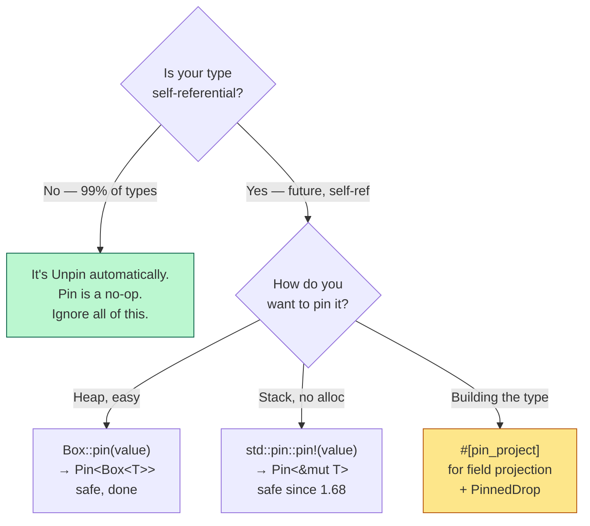

`Pin` is the most-feared type in Rust, and almost all of the fear comes from a single missed premise: **it does not pin anything.** It's a wrapper that removes your ability to get a `&mut T` out — nothing more. Once you see that the whole machine is "take away the one tool that lets you move a value," the `unsafe` blocks, the `Unpin` trait, and the projection dance all fall into place. This is a working tour built around that one idea.

## The problem: in Rust, a move is a `memcpy`

Start with the fact that makes `Pin` necessary. In Rust, moving a value is a bitwise copy of its bytes to a new address, after which the old location is marked dead:

```rust
let a = String::from("hi");
let b = a;   // memcpy the 24 bytes (ptr, len, cap) from a's slot to b's slot;
             // `a` is now statically inaccessible
```

For `String` this is fine — the heap buffer didn't move, only the three-word handle did. Moves are cheap and everywhere: returning from a function, pushing to a `Vec`, passing by value. The compiler assumes it can relocate any value at any time, and 99% of Rust depends on that freedom.

The 1% where it breaks is **self-referential structs** — a value that stores a pointer into itself:

```rust
struct SelfRef {
    data: String,
    ptr: *const String,   // points at `self.data`
}
```

The moment you `memcpy` this struct to a new address, `data` moves with it but `ptr` still holds the *old* address. Now `ptr` dangles. Every read through it is undefined behavior. And the compiler, which thinks moves are always safe, will happily generate that move.

**Plain-English statement of the problem:** some values become unsafe to move once they've been used, but Rust's whole model assumes moving is always safe. We need a way to tell the compiler "this particular value must never move again."

## Why you actually hit this: `async`/`await`

Nobody writes `SelfRef` by hand. You hit this through futures, which is why `Pin` exists in the first place.

When the compiler desugars an `async fn`, it generates a state machine — an enum where each variant holds the locals live across an `.await` point. If one local borrows another (extremely common: `let x = ...; let y = &x; foo(y).await;`), the generated future stores a reference into itself. It is a `SelfRef` in disguise, machine-generated.

A future is polled repeatedly. Between polls it sits somewhere — in a `Box`, in a task slot, in a `join!` tuple. If it could move between polls, its internal self-borrows would dangle. So the contract of `Future::poll` is: **once you start polling a future, it must stay at a fixed address until it completes.** `Pin` is how that contract is expressed in the type system.

That's the whole motivation. Everything else is mechanism.

## The mechanism: `Pin<P>` just takes away `&mut T`

Here's the insight the docs bury. Moving a value requires access to it — specifically, you need either ownership or a `&mut T`, because `mem::replace`, `mem::swap`, and `mem::take` all need `&mut T` to pull the value out and drop a new one in.

So if you want to guarantee a value never moves, you only have to guarantee **nobody can ever get a `&mut T` to it again.**

That's literally all `Pin<P>` does. `Pin<P>` (where `P` is a pointer type like `&mut T` or `Box<T>`) wraps a pointer and refuses to hand out `&mut T` to the thing it points at. Safe code holding a `Pin<&mut T>` can read the `T`, can call `&self` methods, but cannot get the one tool — `&mut T` — that would let it move the value out.

```
     &mut T                    Pin<&mut T>
  ┌───────────┐             ┌───────────────┐
  │ can read  │             │ can read      │
  │ can WRITE │             │ can call &self│
  │ can MOVE  │  ──Pin──►   │ CANNOT get    │
  │ (swap,    │             │   &mut T      │
  │  replace) │             │ CANNOT move   │
  └───────────┘             └───────────────┘
```

`Pin` is a *negative* capability. It's defined by what it removes, not what it adds.

## The escape hatch: `Unpin`

If `Pin` removed `&mut T` for every type, it would be unusable — you could never mutate a pinned `Vec`, `String`, or `i32`, none of which care about their address at all. So Rust adds an auto-trait:

```rust
pub auto trait Unpin {}
```

`Unpin` means "this type does not care about being moved, even when pinned." It is **the default** — almost every type is `Unpin`, automatically, because almost no type is self-referential. `i32`, `String`, `Vec<T>`, your structs — all `Unpin` unless they contain something that isn't.

And the rule is: **if `T: Unpin`, then `Pin<&mut T>` will happily give you back a `&mut T`.** The pin is a no-op for these types.

```rust
let mut x = 42_i32;
let pinned: Pin<&mut i32> = Pin::new(&mut x);
let back: &mut i32 = pinned.get_mut();   // fine — i32: Unpin
```

`Pin::new` and `Pin::get_mut` are **safe functions that require `T: Unpin`.** No `unsafe` needed, because for an `Unpin` type the pin guarantees nothing and takes nothing away.

The only types that are `!Unpin` (not `Unpin`) are:
- Compiler-generated `async` state machines.
- Anything containing `PhantomPinned`.
- Anything built out of the above.

For those, and only those, `Pin` has teeth.

| You have | `T: Unpin` (the default) | `T: !Unpin` (futures, self-ref) |
|---|---|---|
| `Pin::new(&mut t)` | ✅ safe | ❌ not available |
| `pin.get_mut()` → `&mut T` | ✅ safe | ❌ not available |
| `pin.as_mut()` → `Pin<&mut T>` | ✅ safe | ✅ safe |
| Moving the value after pinning | ✅ allowed (pin is a no-op) | 🚫 the whole point: forbidden |
| `unsafe` required to construct | no | yes (`new_unchecked` / `pin!` / `Box::pin`) |

## The two pins you'll actually hold

You mostly meet `Pin` as one of two concrete types:

**`Pin<&mut T>`** — a pinned mutable borrow. This is what `Future::poll` takes: `fn poll(self: Pin<&mut Self>, cx: &mut Context) -> Poll<T>`. It says "you may mutate me in place, but you may not move me out."

**`Pin<Box<T>>`** — a pinned heap allocation. `Box::pin(value)` allocates on the heap and hands you a pin. Because the value lives on the heap and you only hold a pin to it, it's guaranteed to stay put for its whole life. This is the easy, always-safe way to pin something `!Unpin`.

```rust
let fut = async { /* ... */ };            // !Unpin state machine
let mut boxed: Pin<Box<_>> = Box::pin(fut);  // heap-pinned, safe, done
boxed.as_mut().poll(cx);                   // poll it
```

For stack pinning without a heap allocation, the `std::pin::pin!` macro (stable since 1.68) does it safely:

```rust
let fut = async { /* ... */ };
let mut fut = std::pin::pin!(fut);   // Pin<&mut _>, stack-pinned, safe
```

Before `pin!` existed, you needed `pin_utils::pin_mut!` or a raw `Pin::new_unchecked` on a shadowed local. `pin!` made the common case safe.

## The `unsafe` core: `new_unchecked`

Every safe pinning API is built on one unsafe primitive:

```rust
pub const unsafe fn new_unchecked(pointer: P) -> Pin<P>
```

It's `unsafe` because *you* are promising the thing behind `pointer` will never move again for the rest of its life. The compiler can't check that. `Box::pin` and `pin!` can offer safe wrappers precisely because they *control the allocation* — `Box::pin` owns the heap box, `pin!` shadows the stack local so you can't touch it unpinned. They've structurally guaranteed the no-move promise, so they can call `new_unchecked` for you.

The symmetric unsafe getter:

```rust
pub unsafe fn get_unchecked_mut(self) -> &mut T
```

This hands you back the forbidden `&mut T`. It's `unsafe` because you're promising not to use it to move the value. You need it when you're implementing a `!Unpin` type by hand and you *know* a particular field is safe to mutate.

**The rule of thumb:** you should almost never type `unsafe` around `Pin` yourself. Reach for `Box::pin`, `pin!`, and the `pin-project` crate. The unsafe primitives exist so libraries can build safe abstractions; they are not the intended day-to-day surface.

## Pin projection: the genuinely hard part

Here's the real puzzle. You have `Pin<&mut MyStruct>`. You want to poll a future stored in a field. To poll it, you need `Pin<&mut ThatField>`. How do you get from a pinned struct to a pinned field?

This is called **projection**, and it's subtle because it's not always sound. Consider:

```rust
struct Both {
    fut: SomeFuture,   // !Unpin — must stay pinned
    buf: Vec<u8>,      // Unpin — fine to move
}
```

- `fut` is **structurally pinned**: if `Both` is pinned, `fut` must be treated as pinned too (you'd project `Pin<&mut Both>` → `Pin<&mut SomeFuture>`).
- `buf` is **not structurally pinned**: even when `Both` is pinned, you can hand out a plain `&mut Vec<u8>`, because moving the `Vec` handle doesn't break anything.

The catch: you must choose *per field*, and choosing wrong is unsound. If you give out `&mut fut` (unpinned) while `Both` is pinned, someone can `mem::swap` two futures and break their self-references. If you needlessly pin `buf`, you make the type harder to use for no reason.

Doing this by hand requires `unsafe` and a set of rules you must not violate (the "structural pinning" contract in the `std::pin` module docs). **Nobody does it by hand.** The [`pin-project`](https://docs.rs/pin-project) crate generates it for you with a macro:

```rust
use pin_project::pin_project;

#[pin_project]
struct Both {
    #[pin]        // fut IS structurally pinned
    fut: SomeFuture,
    buf: Vec<u8>, // buf is NOT — projected as plain &mut
}

impl Both {
    fn poll_fut(self: Pin<&mut Self>, cx: &mut Context) {
        let this = self.project();
        let _ = this.fut.poll(cx);        // this.fut: Pin<&mut SomeFuture>
        this.buf.push(0);                 // this.buf: &mut Vec<u8>
    }
}
```

The `#[pin]` attribute is you declaring, per field, whether it's structurally pinned. `pin-project` turns that declaration into sound projection code and even generates the correct conditional `Unpin` impl. **If you're writing a manual `Future` or `Stream`, this crate is not optional — it's the standard tool.**

## Pin-safe `Drop`

One more contract. `Drop::drop` takes `&mut self`, not `Pin<&mut self>`. That's a hole: for a `!Unpin` type, drop gets a plain `&mut self` and could theoretically move the value out before destruction — after you promised it would never move.

The rule (from the `std::pin` docs) is: **if your type is `!Unpin` and relies on pinning, your `Drop` impl must not move any structurally-pinned field out of `self`.** You may read them, you may drop them in place, but you may not `mem::replace` or `mem::take` them. `pin-project` helps here too by giving you a `PinnedDrop` variant that hands you `Pin<&mut Self>` in drop instead of `&mut Self`.

The reason this matters: something may still hold a pointer into your pinned data right up until it's destroyed. Moving it during drop invalidates that pointer one instant before the end. Rare, but a real soundness hole the contract closes.

## Putting it together: the mental flow



Green is where almost everyone lives: your types are `Unpin`, `Pin` does nothing, you never think about it. Yellow is the one place real care is required: hand-implementing a `!Unpin` type, where you reach for `pin-project`.

## Misconceptions worth retiring

**"`Pin` pins the value in memory."** No. `Pin` is a pointer wrapper that removes safe access to `&mut T`. The value stays put because nobody can get the tool needed to move it — not because `Pin` nailed it down. The name oversells.

**"I need `unsafe` to use `Pin`."** Almost never. `Box::pin`, `std::pin::pin!`, and `pin-project` cover essentially all application code with zero `unsafe`. The unsafe primitives are for library authors building those safe wrappers.

**"`Pin<&mut T>` means I can't mutate `T`."** You can mutate it — you just can't *move* it. `poll` mutates the future through `Pin<&mut Self>` on every call. For `Unpin` types you can even recover full `&mut T`. Pin restricts moving, not mutation.

**"Everything needs to be pinned for async to work."** Only the future being polled needs to be pinned, and the runtime/`.await` machinery handles that for you. You write `foo().await` and never see a `Pin`. You only meet it when hand-implementing `Future`/`Stream` or storing futures in your own structs.

**"`Unpin` is a special capability I have to opt into."** Backwards. `Unpin` is the default; you get it for free. `!Unpin` is the special case, and you only become `!Unpin` by containing a compiler-generated future or an explicit `PhantomPinned`.

**"Pinning to the stack is unsafe."** It was awkward before 1.68, but `std::pin::pin!` makes stack pinning safe by shadowing the local so you can never access it unpinned. Reach for it before `Box::pin` when you don't need the heap.

## The one-line distillations

> **The problem.** A move is a `memcpy`, and self-referential values (mostly compiler-generated futures) become unsafe to move once used.
>
> **The trick.** To forbid moving, forbid `&mut T` — because every move needs `&mut T`. That's all `Pin<P>` does.
>
> **The default.** `Unpin` means "moving me is fine even when pinned," and nearly every type is `Unpin` automatically. For those, `Pin` is a no-op and every API is safe.
>
> **The teeth.** `Pin` only constrains `!Unpin` types: async state machines and things holding `PhantomPinned`.
>
> **The safe tools.** `Box::pin` (heap), `std::pin::pin!` (stack), `#[pin_project]` (field projection + drop). Application code needs no `unsafe`.
>
> **The hard part.** Projection — deciding per field whether it's structurally pinned. Use `pin-project`; never hand-roll it.

The short version: **`Pin` doesn't pin anything — it removes the `&mut T` that moving requires, and only for the handful of types that can't survive a move.** Once that clicks, the whole feature is small.

## Further reading

- [`std::pin` module docs](https://doc.rust-lang.org/std/pin/index.html) — the authoritative statement of the structural-pinning contract
- [`Future::poll` signature](https://doc.rust-lang.org/std/future/trait.Future.html) — where `Pin<&mut Self>` shows up and why
- [`pin-project` crate](https://docs.rs/pin-project) — the standard tool for sound field projection
- Jon Gjengset, [*Pin and suffering*](https://www.youtube.com/watch?v=DkMwYxfSYNQ) — the deep-dive video walkthrough
- *Rust for Rustaceans* (Jon Gjengset), the async chapter — the best prose treatment
- [*The Async Book*, "Pinning"](https://rust-lang.github.io/async-book/04_pinning/01_chapter.html) — worked self-referential example
- fasterthanlime, [*Understanding Rust futures by going way too deep*](https://fasterthanli.me/articles/understanding-rust-futures-by-going-way-too-deep) — how `Pin` fits the whole async machine
