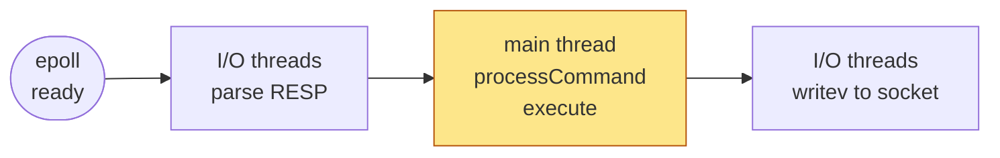
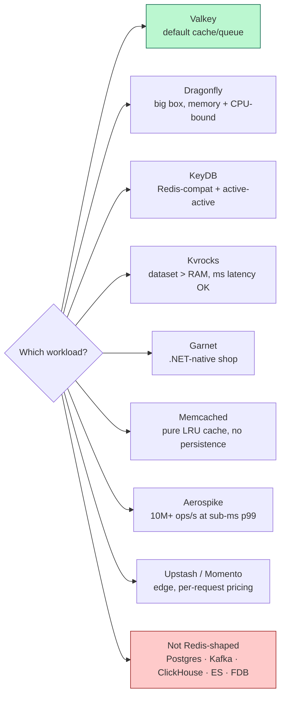

A working tour of Redis: how a `SET foo bar` actually travels from your client through the server and back, why single-threaded is a feature *and* a foot-gun, what the real moat (data structures) looks like, how the 2024 license fork reshuffled the ecosystem, and — since Valkey / KeyDB / Dragonfly / Kvrocks / Garnet all now exist — when to reach for each one.

## The command lifecycle: `SET foo bar` end to end

Redis is a single-threaded, event-driven, in-memory data structure server written in C. Every word does work. The best way to feel it is to walk one command from the client's `SET foo bar` all the way back to `+OK`.

### 1. The wire — RESP

Redis clients speak **RESP** (REdis Serialization Protocol). RESP2 is the default; RESP3 (Redis 6+) is opt-in via `HELLO 3` and adds native maps, sets, booleans, and out-of-band push frames used by client-side caching.

The RESP2 encoding of `SET foo bar` is exactly these 32 bytes:

```
*3\r\n$3\r\nSET\r\n$3\r\nfoo\r\n$3\r\nbar\r\n
```

- `*3` — array of 3
- `$3` — bulk string of length 3, followed by `\r\n` and the 3 bytes

The reply `+OK\r\n` is 5 bytes.

**Pipelining is not a protocol feature.** It's a socket-usage discipline: cram N encoded commands into one `write()`, read N replies from the socket. That's the entire trick. One syscall amortizes N round trips, which is why pipelined Redis benchmarks look ~10x higher than un-pipelined ones.

### 2. Arrival — epoll and the event loop

The listening socket is registered with `epoll_wait` on Linux (or `kqueue` on BSD/macOS), abstracted in `ae_epoll.c` / `ae_kqueue.c`. On `accept()`, Redis allocates a `client` struct holding an input buffer (`querybuf`), a reply list, the fd, parsed `argc`/`argv`, and per-client state (db index, ACL user, flags).

The event loop is `aeMain()` in `ae.c`:

```
while (!eventLoop->stop) {
    timeout = time_to_nearest_time_event();   // serverCron runs at `hz` Hz, default 10
    events  = epoll_wait(fd, ..., timeout);   // file events (I/O)
    fire_readable_and_writable_callbacks(events);
    fire_due_time_events();                   // expiry, rehashing, stats, timeouts
}
```

That's the whole server. No threads (yet), no locks, no scheduler.

### 3. I/O threads (Redis 6.0, 2020) — offload the parsing, keep execution serial

Under load, RESP parsing and `writev` to slow clients dominate CPU. With `io-threads N` and `io-threads-do-reads yes`, worker threads (`IOThreadMain` in `networking.c`) parse RESP in parallel and fan out writes. **Command execution stays on the main thread**, because every data structure would otherwise need locks — losing exactly what makes Redis fast.

The pipeline is a sandwich: the two I/O halves (parse, write) run on worker threads; the meat (execute) stays serial on the main thread.



The yellow node is the only place data structures are touched, and only one thread is ever inside it. Everything else is either socket I/O or a barrier waiting for it.

### 4. Dispatch and execute

`processCommand()` in `server.c`:

1. Look up `argv[0]` in `server.commands` (a hash table).
2. ACL check.
3. If cluster-enabled: `CRC16(key) % 16384` → slot → owner node; return `-MOVED addr` or `-ASK` if this isn't us.
4. Maxmemory / OOM check; write-vs-readonly-replica check.
5. Call `cmd->proc(c)` — for `SET`, that's `setCommand` in `t_string.c`.

`setCommand` writes into `server.db[i].dict` (the big keyspace hash), then calls `signalModifiedKey` (invalidates `WATCH` and pushes keyspace notifications), `propagate()` (AOF + replication), and `addReply(c, shared.ok)`.

### 5. Durability and replication happen inline

- **AOF.** The serialized command is appended to `server.aof_buf`. Before the next `epoll_wait`, `flushAppendOnlyFile()` decides whether to `write()` and `fsync()`:

| `appendfsync` | write | fsync | worst-case loss |
|---|---|---|---|
| `always` | every command | every command | 0 |
| `everysec` (default) | every tick | background, 1/s | ~1s |
| `no` | every tick | never (kernel decides) | many seconds |

- **Replication.** The same command goes into `server.repl_backlog` (a ring buffer) and streams to replicas' client structs. Replicas replay commands on *their own* single main thread. Async by default; `WAIT n ms` for synchronous acks.

### 6. Response out

`addReply()` appends `+OK\r\n` to the client's static reply buffer (16 KB fast path) or a reply list. Before the next `epoll_wait`, `handleClientsWithPendingWrites()` (or an I/O thread) drains buffers with `writev`.

That's the whole loop.

---

## Single-threaded is a feature — and a foot-gun

Rules that fall out of one thread doing everything:

- **Every command is atomic.** No interleaving, ever. `INCR` is a transaction of one.
- **`MULTI` / `EXEC`** queues commands and runs them as one indivisible block. `WATCH k` gives you optimistic CAS.
- **Lua and Functions run to completion on the main thread.** While your script runs, *no other client makes progress*. `SCRIPT KILL` only works on read-only scripts.
- **Slow commands block everything.** `KEYS *` on 10M keys, `SMEMBERS` on a million-member set, `HGETALL` on a giant hash, `DEBUG SLEEP`, `SORT` — each freezes every other client for the duration.

### The plain-English rule

> Think in terms of "µs per op × ops touched by this command." If the product is more than 1 ms, you have a latency incident waiting to happen.

Use `SCAN`, `HSCAN`, `SSCAN` — cursor-based, O(1) per call. Use `UNLINK` instead of `DEL` for big keys (it defers the free to a background thread).

---

## Data structures — the actual moat

Redis's speed and memory efficiency come from picking the right representation at the right size. Every high-level type has a **compact encoding for small values** and a **real structure for large values**, with automatic promotion.

| Type | Small encoding | Large encoding | Threshold (default) |
|---|---|---|---|
| String | `embstr` (≤44B, one alloc) / `int` | raw SDS | 44 bytes |
| List | listpack | quicklist (linked list of listpacks) | `list-max-listpack-size` |
| Hash | listpack | hashtable (chained) | 128 entries |
| Set | intset / listpack | hashtable | 128 entries |
| ZSet | listpack | skiplist + hashtable | 128 entries |
| Stream | radix tree of listpacks | (same) | — |

Things worth knowing:

- **SDS** (Simple Dynamic Strings) is `len | alloc | flags | char[]` where the returned pointer is *after* the header, so `printf("%s", sds)` still works. Binary-safe, O(1) length, amortized append.
- **Listpack** replaced ziplist in Redis 7.0 — same contiguous-prefix-encoded idea, without the cascading-update bug ziplist had.
- **Quicklist** is a doubly linked list of listpacks — O(1) push/pop at either end, LZF-compressed interior nodes for cold ranges.
- **Sorted set = skiplist + hashtable.** The hash gives O(1) `ZSCORE`; the skiplist gives O(log N) rank/range. Why skiplist not RB-tree? Antirez's answer: (a) range scans are just walking level 1 — no successor traversal; (b) with `p=1/4`, avg 1.33 forward pointers/node vs 2 pointers + color bit in RB-tree — less memory; (c) insert/delete just rewrites neighbor pointers — no rotations to reason about at 3 AM.
- **HyperLogLog** is a 12 KB dense (or sparse listpack) bitmap of 2¹⁴ registers with 6 bits each — 0.81% standard error, fixed memory regardless of cardinality.

---

## Persistence: fork() is the mechanism

- **RDB** — point-in-time snapshot. `BGSAVE` calls `fork()`; the child walks the keyspace and writes a compressed binary dump. The parent keeps serving. **The COW cost**: every page the parent *writes* during the fork gets duplicated. On a write-heavy workload with a 100 GB dataset, RDB can transiently push RSS toward 2×. Set `vm.overcommit_memory=1` or you'll get `fork` failures.
- **AOF** — a write-ahead log of RESP commands. Grows unbounded until `BGREWRITEAOF` — another fork that dumps current state as commands, then appends the delta accumulated during the rewrite.
- **Hybrid RDB-AOF** (4.0+, `aof-use-rdb-preamble yes`, default): AOF file starts with an RDB dump, then appends commands since. Fast reload, cheap rewrite. **This is what you want.**
- **Recovery order.** If both exist, AOF wins.

Fork is also the source of the biggest Redis tail-latency incidents. Antirez has [documented](https://antirez.com/news/83) sub-second stalls on Xen-based EC2 and with Transparent Huge Pages enabled. Every alternative that markets itself as "no fork" is selling this exact pain.

## Cluster mode

- **16384 slots**, `CRC16(key) % 16384`. That number was picked so the slot bitmap is 2 KB — small enough to piggyback on every heartbeat.
- **No proxy.** Clients cache slot→node maps and get corrected via `-MOVED host:port slot` (permanent) or `-ASK host:port slot` (during migration; client must send `ASKING` before the retry).
- **Gossip.** Every node PINGs a random subset of peers on a bus port every second, exchanging slot ownership, epoch, and failure suspicions.
- **Hash tags** — `{user:42}:profile` and `{user:42}:sessions` both hash on `user:42` and land on the same slot. Required for multi-key commands and transactions.
- **Sentinel** is the non-sharded HA cousin: 3+ sentinels monitor a single primary + replicas, coordinate failover, tell clients where to connect.

---

## The 2024 license saga (and why "Redis" now has quotes around it)

- **March 2024.** Redis Ltd. drops BSD for a dual **SSPLv1 / RSALv2** license — source-available, not OSI open source.
- **March 2024.** AWS, Google, Oracle, Ericsson, and Snap fork Redis 7.2.4 into **Valkey** under the Linux Foundation, BSD-3.
- **Nov 2024.** Antirez rejoins Redis Ltd. as evangelist.
- **May 2025.** Redis 8 ships under **AGPLv3** (OSI-approved) — a tri-license with SSPL/RSAL still on offer.
- **Mid-2026.** Valkey has won the distributions. Fedora 42, Ubuntu 26.04 LTS, Debian 13 backports, and Arch ship Valkey by default. AWS ElastiCache for Valkey is ~20% cheaper than for Redis and delivers ~8% more ops/sec and ~22% lower p99. Redis 8 still leads on newer features (vector search, JSON, time series in-core).

**Plain-English rule for 2026.** The wire protocol is identical, the client libraries are the same, migration is a config change. Pick on license politics, feature set, and who's writing your infra check.

---

## The alternatives, by implementation model

The interesting axis isn't "which is fastest" — it's "how does it turn CPUs and memory into throughput." Grouped by how the server is put together:

| Project | Threading | Storage | Event loop | Wire | License |
|---|---|---|---|---|---|
| **Redis 8** | Main loop + I/O threads (parse/write only) | RAM + RDB/AOF | epoll | RESP2/3 | AGPLv3 |
| **Valkey 8.x** | Main loop + async I/O threads | RAM + RDB/AOF | epoll (+ RDMA verbs) | RESP2/3 | BSD-3 |
| **KeyDB** | N worker threads, each with own loop | RAM + optional FLASH tier | epoll | RESP2 | BSD-3 |
| **Dragonfly** | Shared-nothing thread-per-core | RAM + SSD tiering | **io_uring** | RESP2/3 | BSL 1.1 |
| **Kvrocks** | Thread pool | **RocksDB (LSM on disk)** | epoll | RESP2/3 | Apache 2.0 |
| **Garnet** | Managed .NET thread pool | Tsavorite hybrid (RAM+SSD) | `SocketAsyncEventArgs` | RESP2 | MIT |
| **Memcached** | Multi-thread, per-slab locks | RAM only | libevent | memcached | BSD |
| **Aerospike** | Multi-thread, NUMA-pinned | RAM index + raw SSD | custom | custom binary | AGPL (community) |

### The three groups worth understanding

**Group 1 — RESP drop-ins.** Valkey (BSD fork), KeyDB (multi-thread fork), Dragonfly (thread-per-core rewrite), Kvrocks (RocksDB backend), Garnet (.NET rewrite), Redict (LGPL fork). Same wire; different guts.

**Group 2 — non-drop-in caches / KV stores.** Memcached (simplest possible cache), DiceDB (reactive-queries niche), FoundationDB (ACID KV — what people move to when they outgrow Redis-as-database).

**Group 3 — bigger-scale competitors.** Aerospike (hybrid RAM+SSD at ad-tech scale), ScyllaDB (Cassandra-compat, shard-per-core), Hazelcast (JVM data grid).

### The two rewrites worth understanding in detail

**Dragonfly.** Written in C++, shared-nothing thread-per-core (Seastar-shaped), io_uring underneath. Each shard is single-threaded — no locks on the hot path — and cross-shard commands (MGET, MSET, transactions) coordinate through a "Serial Point." The signature piece is **dashtable**, a segment-based extendible hash table with fingerprint-based probing (SwissTable-adjacent). Segments are ~4 KB, cache-line-friendly, and give ~30% less memory than Redis's `dict`. Snapshotting is fork-less — no COW spike. Published: ~3.8M ops/sec on `c6gn.16xlarge`. License is BSL 1.1 (converts to Apache 2.0 after 4 years), which is why hyperscalers won't touch it managed-side.

**Garnet.** Microsoft Research, written in C#. RESP2-compatible; the storage layer is **Tsavorite** (successor to FASTER) — a "narrow-waist" KV interface with in-memory hybrid log + optional SSD + optional cloud object storage. Non-blocking checkpointing, multi-key transactions at the storage layer. `redis-cli` and StackExchange.Redis work unmodified. Recent additions include Vector Sets backed by DiskANN. Production adoption outside Microsoft is still thin.

---

## What the benchmarks actually say

### Throughput on similar hardware

| Store | Typical single-box throughput | Notes |
|---|---|---|
| Redis 7 (single-threaded) | ~150–200K ops/s per core, ~1M with heavy pipelining | GET/SET, localhost |
| KeyDB | ~1M+ ops/s, 3–5x Redis on multi-core | N event loops in one process |
| Dragonfly | ~3.8M ops/s on `c6gn.16xlarge`; ~10M SET / 15M GET pipelined | Thread-per-core |
| Valkey 8.0 | 1.19M RPS on `c7g.4xlarge` (~2.3x Valkey 7.2, ~8% > Redis 7.4) | Async I/O threading |
| Garnet | ~10x Redis on GET (MSR's own bench) | `Resp.benchmark` on Azure `F72s v2` |
| Memcached | 15–30% higher raw string GET/SET than Redis multi-core | Slab allocator, per-slab locks |
| Aerospike | 4–10M ops/s at sub-ms p99; documented at 100 TB / 95B objects | Hybrid RAM+SSD, cluster-native |
| Kvrocks | ~150–250K ops/s (disk-bound) | RocksDB LSM, write-amp dominates mixed |

**Caveats worth flagging.** Dragonfly's "25x Redis" compares one Redis process against a fully-threaded Dragonfly; real Redis deployments shard across processes, which closes some of the gap. Percona's Valkey 8 vs Redis 7.4 numbers (37% higher SET, 16% higher GET, 30–60% faster p99 on the same instance class) are the cleanest apples-to-apples number in public today.

### Latency — the tail is the story

Redis localhost GET/SET is comfortably p50 ~100 µs, p99 ~300–500 µs on an idle box. The interesting story is where the tail blows up:

- **Fork on BGSAVE**: COW page faults freeze the main thread; sub-second stalls documented on EC2 with THP enabled.
- **Big-key `DEL`**: O(N) on the main thread. `UNLINK` fixes it if you remember to use it.
- **Lua / EVAL**: blocks everything.
- **AOF `fsync everysec`**: fine, until the disk stalls.

Dragonfly sidesteps all four: snapshots don't fork, per-shard work is bounded, I/O never blocks a data thread. Aerospike is the gold standard for tail latency at scale — Unity documented p99 <1 ms at 10M ops/s.

### Memory efficiency

Redis carries **70–90 bytes/key** of fixed overhead: 24-byte dictEntry + 16-byte redisObject + two SDS headers + jemalloc size-class padding. For short-value workloads this dominates. Dragonfly's dashtable reports **25–30% less memory per key** than Redis. Memcached's slab allocator carries ~60 bytes/key but wastes 20–30% inside slab classes if value sizes vary.

---

## Pros and cons, in one glance

| Project | Pros | Cons |
|---|---|---|
| **Redis** | 15 years of production hardening — every failure mode has been seen; unbeatable ecosystem; module system (Search, JSON, TimeSeries); rich data structures | AGPL blocks some managed-service resale; single-thread wastes 90% of a modern box; fork spikes; big keys are footguns |
| **Valkey** | BSD-3 under LF; drop-in for Redis 7.2.4; async I/O gives 2–3x throughput vs Valkey 7; ~20% cheaper on ElastiCache | Governance still young; module ecosystem lags Redis 8; diverging feature set already visible |
| **KeyDB** | Multi-master active replication OSS Redis lacks; 3–5x throughput; BSD-3 | Snap acquisition slowed public roadmap; multi-thread edge cases in Lua/txns; commercial support thin |
| **Dragonfly** | Thread-per-core scales linearly to 64+ cores; snapshotting doesn't fork; 25–30% less memory | BSL not OSI-approved; module gaps (no Search/JSON parity); cluster mode younger |
| **Kvrocks** | Datasets 10–100x larger than RAM at 1/10 cost; Apache 2.0; Redis-compat | Latency is ms not µs; write-amp hurts mixed workloads; small community |
| **Garnet** | Genuinely fast; pluggable storage; MIT; native .NET | .NET runtime cost for non-.NET shops; client-compat gaps; young in production |
| **Memcached** | Simplest ops; multithreaded from day one; predictable under pressure; 15–30% higher raw string throughput | No persistence, no replication, no data structures beyond strings; no pub/sub or streams |
| **Aerospike** | Sub-ms p99 at 10M+ ops/s proven at Unity/PayPal/Adform; hybrid RAM+SSD cuts cost 80%; strong-consistency mode | Proprietary core; complex ops; overkill for <1M ops/s; not RESP |

---

## Decision framework

Start from the question in the middle, then follow whichever branch matches your workload. The one-liner on each leaf is the *why*, not the full argument — the sections above have the reasoning.



Green is the safe default; red is "don't reach for anything Redis-shaped." Everything else is a specific tradeoff you should only take if the workload demands it.

---

## Misconceptions worth retiring

**"Redis is fast because it's in-memory."** Half the story. Redis is fast because it's in-memory *and* single-threaded *and* uses the right data structure per size. A multi-threaded in-memory store with locks is not automatically faster than Redis; it's usually slower until you can eliminate contention on the hot path (the whole reason Dragonfly went thread-per-core, not thread-pool).

**"Multi-threading means Nx throughput."** Only if the workload sharded cleanly. Cross-shard commands (`MGET k1 k2 k3` across three cores) need coordination, and that coordination is where naive multi-threaded rewrites lose all their gains.

**"Valkey is just Redis with a different logo."** It was, in April 2024. By mid-2026 the code has diverged meaningfully — Valkey 8's async I/O threading is more aggressive than Redis 8's, and the two projects are on visibly different roadmaps.

**"I'll switch to Dragonfly for the 25x."** That number is one Redis process vs a full-server Dragonfly. If you're already running Redis Cluster with N shards, the honest comparison is closer to 2–4x — still worth it for a fleet, but do the math on your workload.

**"AOF `everysec` is durable enough."** Until the disk stalls or you crash mid-fsync. `everysec` is a ~1s data-loss window, and you should own that number the same way you own your RPO/RTO.

**"Redis Streams is Kafka."** No. Streams gives you consumer groups and PEL, but with a single-node write ceiling, no partition rebalancing, no exactly-once, and no retention-time story you'd want on a real event bus. Streams is fine for job queues and small pipelines. It is not durable ordered messaging at Kafka scale.

**"Persistence + Redis = database."** Redis is durable enough to survive a restart if configured for it. It is not durable enough to be your primary datastore. Every team that has learned this the hard way went to Postgres (or FoundationDB) afterward, not to a fancier cache.

---

## The one-line distillations

> **The core.** One thread, one event loop, one dict. RESP in, RESP out. I/O threads parse and write, but every command executes serially.
>
> **The moat.** Per-type dual encodings (listpack for small, real structure for large) and hand-tuned data structures (SDS, quicklist, skiplist, radix tree, HLL). This is what makes Redis feel effortless.
>
> **The footgun.** Slow command = frozen server. Big fork = tail spike. Big key `DEL` = tail spike. Lua = tail spike. Every Redis outage story is one of these four.
>
> **The alternatives.** Same wire, different guts. Valkey rewrites the I/O layer. KeyDB runs N loops in one process. Dragonfly goes thread-per-core on io_uring. Kvrocks puts RocksDB behind RESP. Garnet does it in .NET. Memcached and Aerospike don't speak RESP; they're the right answer when Redis's shape is wrong.
>
> **The choice.** Valkey is the safe default in 2026. Dragonfly is worth a pilot if you're paying for a big fleet. Aerospike if the tail latency requirement is real. Everything else is workload-matching.

The short version: **Redis's single-threaded design was the right call for 2009 hardware and 2009 workloads.** The alternatives exist because 2026 hardware has 64+ cores, io_uring, and NVMe, and there's real throughput on the table for anyone willing to redesign around it. Pick based on what you're actually running, not what the benchmark headline says.

---

## Further reading

- [RESP protocol spec](https://redis.io/docs/latest/develop/reference/protocol-spec/)
- [Redis event library internals](https://redis.io/docs/latest/operate/oss_and_stack/reference/internals/internals-rediseventlib/)
- [Redis Cluster spec](https://redis.io/docs/latest/operate/oss_and_stack/reference/cluster-spec/)
- Antirez, [*Redis latency spikes and the 99th percentile*](https://antirez.com/news/83) — the persistence-fork story from the source
- [antirez/sds README](https://github.com/antirez/sds/blob/master/README.md) — the string type walkthrough
- [Redis 8 AGPLv3 announcement](https://redis.io/blog/agplv3/) and [antirez's "Redis is open source again"](https://antirez.com/news/151)
- [What is Valkey?](https://redis.io/blog/what-is-valkey/) and [Valkey 8.0 GA](https://valkey.io/blog/valkey-8-0-0-rc1/)
- [Dragonfly: Redis vs Dragonfly scaling](https://www.dragonflydb.io/blog/scaling-performance-redis-vs-dragonfly)
- [Microsoft Research: introducing Garnet](https://www.microsoft.com/en-us/research/blog/introducing-garnet-an-open-source-next-generation-faster-cache-store-for-accelerating-applications-and-services/)
- [Apache Kvrocks: how we use RocksDB](https://kvrocks.apache.org/blog/how-we-use-rocksdb-in-kvrocks/)
- [Aerospike hybrid memory architecture](https://aerospike.com/products/features/hybrid-memory-architecture/)
- Yao Yue et al., [*A Large-Scale Analysis of In-Memory Key-Value Cache Clusters at Twitter*](https://dl.acm.org/doi/fullHtml/10.1145/3468521) — the Pelikan background
- [How Discord migrated trillions of messages from Cassandra to ScyllaDB](https://www.scylladb.com/tech-talk/how-discord-migrated-trillions-of-messages-from-cassandra-to-scylladb/)
