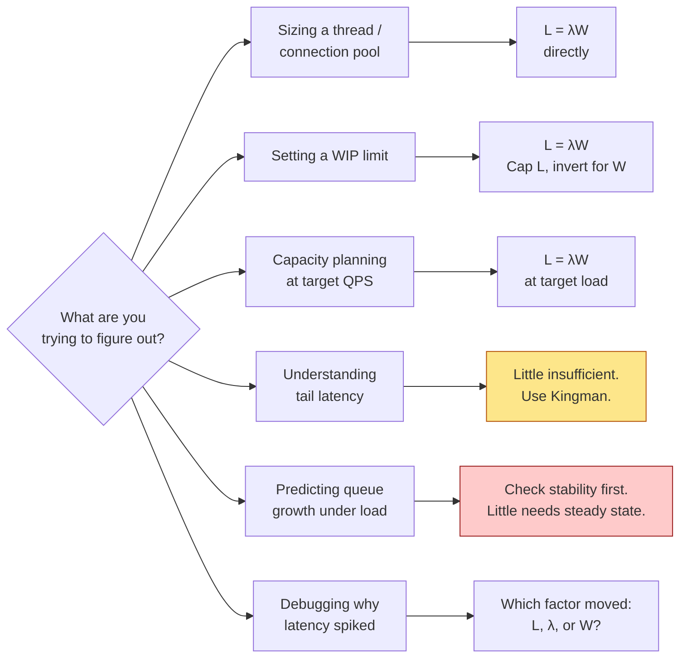

Every capacity-planning conversation, every "how big should the thread pool be" argument, every Kafka backlog post-mortem, every "why did latency spike when we added a feature" investigation — all of them are, at their core, one equation being applied and often misapplied. This is a working tour of that equation: what it says, why it's true, why its generality is genuinely shocking, and how to use it without getting fooled by the averages.

## The equation

```
L = λ · W
```

Three symbols, one identity, no assumptions.

| Symbol | Meaning | Units |
|---|---|---|
| **L** | Average number of items in the system | items (dimensionless count) |
| **λ** | Average arrival rate (= departure rate in steady state) | items / time |
| **W** | Average time an item spends in the system | time |

Dimensional analysis alone forces the shape: `items = (items/time) × time`. There is no other relationship among these three quantities that could work. Once you know two of them, you know the third — with no further information about the workload, the service discipline, or the distributions involved.

## Why it's true (the sample-path intuition)

Watch a busy system for a long interval `[0, T]`. Draw the number of items in flight as a function of time — a jagged sawtooth going up on arrivals and down on departures.

- The **area under that curve** is the total "item-time" the system accumulated — the sum of every item's stay length.
- Divide by `T` and you get **L**, the time-averaged number in flight.
- Divide the same total by the number of items that came through and you get **W**, the average time per item.
- The number that came through, divided by `T`, is **λ**.

So `L × T = W × (λ × T)`, and the T's cancel. That's it. That's Little's Law.

The 1961 proof by John Little is a bit more careful about the limit as T grows, but the intuition is exactly this: **the area under the concurrency curve can be measured two ways, and both ways have to agree.** No probability, no distributions, no assumptions about how arrivals cluster or how service times vary. It's a bookkeeping identity.

## The genuinely shocking part

Every other formula in queueing theory demands assumptions. M/M/1 needs Poisson arrivals and exponential service times. Kingman's approximation needs coefficients of variation. Erlang-C needs blocked-calls-cleared. Even Amdahl's law needs a specific parallelism model.

Little's Law needs **none of that**. It holds for:

- Any arrival distribution — bursty, uniform, adversarial, doesn't matter.
- Any service time distribution — deterministic, heavy-tailed, arbitrarily correlated with arrivals.
- Any scheduling discipline — FIFO, LIFO, priority, random, work-stealing, whatever.
- Any number of servers.
- Any topology — single queue, network of queues, mesh, ring.

The only requirement is **stability**: over the interval you measure, average arrival rate equals average departure rate. If items pile up faster than they leave forever, Little's Law says nothing — but you have bigger problems than knowing L.

This generality is what makes it the F=ma of systems engineering. Newton's second law doesn't care whether the force is gravity or a spring or a rocket; Little's Law doesn't care what your queue looks like inside. It's the deepest relationship performance engineering has.

## The fine print: stability, intervals, and what counts as "the system"

Three subtleties trip people up.

**Stability isn't optional.** Little's Law is a statement about averages over an interval where average-in equals average-out. If your service is scaling down while measurements are running, or the queue is growing across the interval, the equation still holds *mathematically* — but W is being computed against items that haven't left yet, and you're measuring a transient. In practice, pick an interval long enough that most items that arrived during it have also departed by the end.

**"The system" is whatever you draw a box around.** L, λ, and W are always defined with respect to a specific boundary. Same box, same equation. Different box, different numbers — but still the same equation. You can apply Little's Law to a single method call, a thread pool, a load balancer, a whole data center, or "all HTTP requests inside the company." What changes is what you're counting.

**Steady-state matters.** The equation is about time averages. During a warm-up, a scale event, or a cold cache, the instantaneous L is not λW. Give the system time to reach the interval you're measuring.

## Applications: what the equation actually buys you

Once you internalize `L = λW`, capacity planning stops being guesswork. Almost every "how many X do I need" question is Little's Law in disguise.

### 1. Thread pool and connection pool sizing

This is the canonical use.

Your service handles **5000 requests/second**. Each request holds a DB connection for an average of **20 ms**. How big should the connection pool be?

```
L = λ · W = 5000 req/s · 0.020 s = 100 concurrent connections
```

You need at least 100 slots on average. If your pool is 50, requests queue; if it's 500, most of them sit idle. **This is the exact math behind every "you sized your thread pool wrong" incident.**

Do it in reverse and it's just as useful. You have 200 threads and the average request holds one for 40 ms. Peak throughput before queuing:

```
λ = L / W = 200 / 0.040 = 5000 req/s
```

Above 5000 rps, arrivals outrun capacity and W starts blowing up.

### 2. Web service capacity planning

Same math, at a higher level.

Suppose your endpoint has **p50 response time = 30 ms** and you want to serve **20,000 rps** without saturating any component. Average in-flight requests:

```
L = 20000 · 0.030 = 600 concurrent
```

That's your target for the sum of connection pool + worker threads + downstream inflight. If any single stage in the pipeline has a lower concurrency ceiling than 600, that stage is your bottleneck — and Little's Law tells you exactly where to look.

### 3. Kafka / queue backlog and the stability boundary

Producers write **10,000 messages/second**. Consumers process each message in **150 ms**, single-threaded, with **8 consumer instances**. Are you keeping up?

Consumer aggregate throughput is `8 / 0.150 = 53.3 msg/s per instance × 8 = 426 msg/s`... wait, that's not right. Let me redo: each consumer processes `1/0.150 = 6.67 msg/s`; eight of them do `53.3 msg/s`.

You're producing 10,000/s and consuming 53/s. **Little's Law refuses to apply** — you are not stable. Backlog grows without bound, W grows without bound. The equation isn't telling you "how big is the queue"; it's telling you "your queue does not have a steady state." Fix it by adding consumers, splitting partitions, or reducing per-message work until aggregate consumer throughput exceeds producer throughput.

Once you *are* stable, Little's Law tells you the equilibrium backlog. If consumers process 12,000/s while producers send 10,000/s, and per-message time in the broker is 5 ms, then average backlog is `10000 · 0.005 = 50 messages`. Bursts push it higher; the average settles at 50.

### 4. Kanban WIP limits — the same equation, wearing a suit

If throughput `λ` is fixed by team capacity, then capping work-in-progress `L` caps cycle time `W = L / λ`. That's the entire theoretical foundation of kanban: **at constant throughput, less WIP means shorter lead times.** Toyota didn't invent Little's Law; they operationalized it.

This is also why "stop starting, start finishing" works. You cannot change your team's true throughput by pushing more work into the system. All you change is L. And when L goes up at fixed λ, W goes up proportionally.

### 5. The Amazon "reduce response time to shrink the fleet" trick

Amazon services are internally sized against a target concurrency. Since `L = λW`, if you reduce W (make requests faster) at fixed λ (traffic), L drops proportionally — which means you can run fewer instances.

Cutting p50 latency from 100 ms to 50 ms doesn't just make users happy. At the same traffic, it cuts required inflight capacity in half, which cuts fleet size in half, which cuts the bill in half. Marc Brooker and others have written about this pattern; it's the reason latency work gets so much engineering investment inside AWS.

### 6. Response time from throughput and think time

The Response Time Law is Little's Law rearranged for interactive systems:

```
R = N / X − Z
```

where `N` is number of users, `X` is throughput (transactions/s), and `Z` is think time (idle time per user between requests). Derive it by drawing the box around "users doing transactions," applying `L = λW`, and separating the time spent thinking from the time spent in the system.

Practical use: you observe `X = 200 tps`, you have `N = 500` active users, and you know `Z = 2 s` from instrumentation. Then:

```
R = 500 / 200 − 2 = 0.5 s
```

Half a second average response time. If R is worse than that, you have a bug or a hidden bottleneck.

## What Little's Law is a special case of (and vice versa)

Little's Law is the parent equation. Many familiar performance formulas are Little's Law with extra assumptions layered on:

- **Utilization Law**: `U = X · S`, where `U` is server utilization, `X` is throughput, and `S` is average service time per unit. This is Little's Law applied to *the server itself* — the server is a system of capacity 1, and utilization equals the average number of "items being served," which by Little equals throughput times service time.

- **M/M/1 mean number**: `E[N] = ρ / (1 − ρ)`, where `ρ = λ/μ`. Combine with Little to get `E[W] = 1/(μ − λ)`. The `(1 − ρ)` in the denominator is where the "latency goes hyperbolic near 100% utilization" behavior comes from.

- **Kingman's formula**: `E[W_q] ≈ (ρ/(1−ρ)) · ((C_a² + C_s²)/2) · S`. This says queue waiting time scales with the *product* of utilization pressure (`ρ/(1−ρ)`) and workload variability (`C_a`, `C_s`). This is why bursty traffic and high-variance service times destroy tail latency long before average utilization looks bad.

You can climb the ladder from Little to any of these. You cannot climb down — the specific formulas need assumptions Little doesn't.

## Where Little's Law lies to you

Little's Law is exact for averages. Averages hide tails. **This is where most misapplications live.**

If you use `L = λW` to size for the average, you'll build a system that runs at exactly p50 forever and falls over at every burst. The average tells you the steady-state footprint; it tells you nothing about how big the queue gets during a spike, how long the tail of W is, or how the system behaves at 95% utilization.

Three specific traps:

1. **"My average latency is fine, so my thread pool is sized right."** Kingman's formula says tail latency explodes as utilization approaches 1 — even if average is comfortable. A pool sized for average λ will spend real time in queueing purgatory at bursts of 2× that. Size for the traffic you actually get, including the peaks.

2. **"Two systems with the same L, λ, W are equivalent."** They have the same *first moment*. Their p99 behavior can differ by orders of magnitude depending on the coefficient of variation of arrivals and service. Little's Law doesn't see distribution shape.

3. **"Little's Law tells me the queue length."** No, it tells you the *average* queue length. Peak queue length under bursts can be many multiples of the mean. If you're sizing a Kafka retention buffer against `λW`, you're going to spill.

The mental model: **Little's Law gives you the center of gravity. The tails are a separate conversation.**

## Decision framework: when to reach for Little's Law



Yellow: Little's Law alone won't answer this — you need distributional tools on top. Red: Little's Law doesn't apply at all — the system is unstable, fix that first.

The universal debugging move: **when W spikes, ask which of the other two moved.** If λ went up, you're overloaded. If λ is flat and L went up, something upstream is holding items longer than usual — a stuck downstream, a leaked connection, a GC pause. Little's Law is a triangulation tool: any two variables constrain the third.

## Misconceptions worth retiring

**"Little's Law requires Poisson arrivals."** No. It requires stability. Poisson is required for M/M/1, not for Little. This confusion is the single biggest reason engineers dismiss Little's Law as "too idealized to use" — it isn't idealized at all.

**"Little's Law only works for queues."** It works for anything with a well-defined boundary and flow through it. HTTP requests through a service, tickets through a support team, patients through a hospital, cars through a highway, water through a pipe. The equation is topology-free.

**"L, λ, W must be measured over the same time interval."** They must be time averages over a stable interval, yes. But the interval doesn't have to be pre-specified. You can compute λ from a day of logs, W from a week of tracing, L from live instrumentation, and as long as the underlying system is roughly stable, the equation still holds. Different sample sizes will introduce noise, but not bias.

**"If I halve W, I halve L."** Only at fixed λ. In practice, faster response times often *increase* λ because users retry less and hit refresh more. The relationship is an identity, not a lever. Halving W and keeping λ constant is a design choice you have to make explicitly.

**"Little's Law tells me maximum throughput."** No. It relates three averages. Max throughput is a separate question that depends on your slowest resource (Amdahl / bottleneck analysis). Little's Law tells you what happens *at* a given throughput; it doesn't tell you what throughput is achievable.

**"The equation is too simple to be useful."** It's exactly as simple as F=ma, and F=ma is the most useful equation in classical mechanics for the same reason: **generality**. Simplicity is the point.

## The one-line distillations

> **The identity.** `L = λW`. Average concurrency equals average arrival rate times average time in system.
>
> **The proof.** Area under the concurrency curve, computed two ways.
>
> **The scope.** Any stable system, any distribution, any discipline, any topology. No exceptions inside its regime.
>
> **The fine print.** Requires stability. Time averages, not instantaneous values. "The system" is defined by the boundary you draw.
>
> **The uses.** Pool sizing (`L = λW` gives you the pool), capacity planning (target `λ`, measured `W`, solve for `L`), WIP limits (cap `L` to bound `W`), debugging (which of the three moved).
>
> **The limits.** Tells you averages, not tails. Kingman's formula and higher moments live above Little on the ladder. A system correctly sized for average `L` can still fail at p99.
>
> **The mindset.** Little's Law is a bookkeeping identity, not a performance model. Use it to *constrain* what's possible; use Kingman, Erlang, and measurements to understand what's likely.

The short version: **Little's Law tells you the center of gravity of any queueing system for free. Everything else is figuring out how far around it your workload actually swings.**

## Further reading

- John D. C. Little, [*A Proof for the Queuing Formula: L = λW*](https://www.jstor.org/stable/167570) (Operations Research, 1961) — the original paper
- Raj Jain, *The Art of Computer Systems Performance Analysis* (1991) — chapters 30-31 on operational laws
- Neil Gunther, [*Guerrilla Capacity Planning*](https://www.perfdynamics.com/iBook/GCP.html) — chapter 4 on Little's Law in practice
- Marc Brooker, [*A Quest for Predictable Latency with Little's Law*](https://brooker.co.za/blog/2021/01/22/close-open.html) — the AWS perspective
- Google SRE Book, [*Handling Overload*](https://sre.google/sre-book/handling-overload/) — where the stability requirement bites in production
- Adrian Colyer, [*Applying Little's Law to modern systems*](https://blog.acolyer.org/) — approachable examples across the stack
- David J. Little, [*Little's Law as Viewed on Its 50th Anniversary*](https://www.informs.org/) — retrospective by the author
