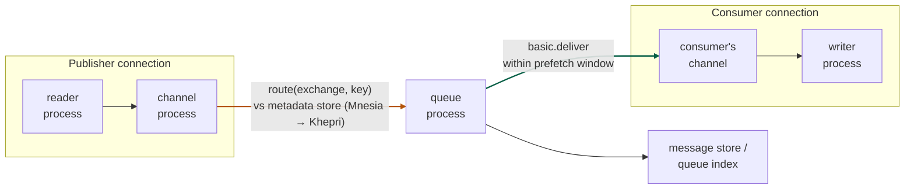
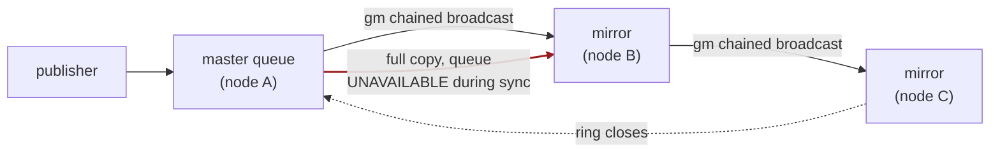
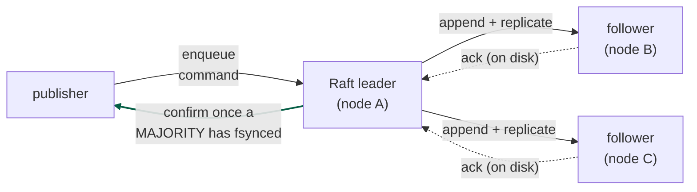

A working tour of what's actually inside RabbitMQ: why every queue is a single Erlang process and what that costs, where messages physically live, how credit-based flow control propagates backpressure hop by hop, why classic mirroring was ripped out and replaced with per-queue Raft clusters, and which metrics observe which internal mechanism. The official docs teach you the AMQP API; this is the machine underneath it.

## The setup: the docs teach the API, the broker lives elsewhere

The AMQP 0-9-1 model fits in one table:

| Object | Role | Contract |
|---|---|---|
| **Exchange** | Named router | Producers publish here, never to queues |
| **Binding** | Routing rule | Pattern matching routing keys to queues |
| **Queue** | FIFO buffer | Holds messages until acked, then deletes them |
| **Channel** | Session | Multiplexes work over one TCP connection |
| **Ack / prefetch** | Delivery contract | Broker tracks every unacked delivery per consumer |

That's the whole user-facing surface, and it's what every tutorial covers. But none of it explains why one queue caps out around 50K msg/s while the broker handles millions, why a memory alarm on node 3 freezes publishers connected to node 1, why persistent messages sometimes never touch disk, or what actually replicates when you declare a quorum queue. Those answers live one layer down — in the Erlang runtime, the storage subsystem, the credit system, and the Raft implementation. That layer is the interesting one, and it's barely documented in one place.

**The one-sentence thesis of this post:** RabbitMQ is a message broker built *out of* message passing — every architectural property it has, good and bad, falls out of the Erlang actor model it's implemented in.

---

## The substrate: everything is an Erlang process

RabbitMQ is written in Erlang and runs on the **BEAM** VM — the runtime built at Ericsson for telephone switches, designed around three ideas:

1. **Processes are cheap.** A BEAM process is a few KB: its own stack, its own heap, no shared memory. Millions per node is normal.
2. **Processes share nothing.** All communication is asynchronous message passing into a process's mailbox. No locks anywhere in application code.
3. **Scheduling is preemptive and per-core.** One scheduler thread per core; each process runs for a budget of *reductions* (~4,000 function calls in modern OTP) and is then descheduled, mid-whatever-it-was-doing. No process can hog a core; GC is per-process, so no global pauses.

Everything in RabbitMQ maps onto this:

| AMQP concept | BEAM reality |
|---|---|
| TCP connection | A **reader** process + a **writer** process |
| Channel | One process per channel |
| Queue | **One process per queue** — the load-bearing fact |
| Quorum queue member | One `ra` (Raft) server process per replica |
| Message store | A process per vhost |
| Management stats | An aggregation process pipeline |

Consequences you can now derive instead of memorize:

- **FIFO is free.** A queue is one sequential mailbox-draining loop; ordering needs no locks because there's nothing concurrent to lock against.
- **One queue ≈ one core, forever.** A process runs on one scheduler at a time. Sixteen consumers on one queue still funnel through one sequential actor. This is the per-queue throughput ceiling (~tens of K msg/s), and no hardware raises it.
- **Queues parallelize beautifully *across* each other.** 200 queues on a 16-core box use all 16 cores. The broker's scaling unit is the queue, not the consumer — which is why the answer to nearly every RabbitMQ capacity question is "more queues" (usually via a consistent-hash exchange).
- **Isolation is real.** One crashing queue process is restarted by its supervisor without touching its neighbors — the Erlang "let it crash" discipline is why the broker itself is famously hard to kill even while individual queues misbehave.

> **Mnemonic.** Redis: one thread for the whole server. RabbitMQ: one "thread" (process) *per queue*. Same ceiling, different granularity — and the granularity is the whole scaling model.

---

## Follow one publish through the processes

Here is what `basic.publish` actually traverses — every arrow is an Erlang message into another process's mailbox:

Two things the diagram encodes: **routing runs inside the publishing channel process** (the orange edge — no separate router hop), and there is **one queue process per queue** (the blue edge fans out to whichever queue PIDs the routing function returned).

The step that surprises everyone: **exchanges are not processes.** An exchange is a *row in the metadata store*, and routing is a *function call executed inside the publishing channel's process* — a lookup of the bindings table (a topic-exchange match walks a trie) that returns a list of queue PIDs. Then the channel sends the message directly to each queue process. There is no "router" to bottleneck on; routing capacity scales with channel count, i.e., with publishers themselves.

The metadata store holding those exchanges, bindings, users, and vhosts was **Mnesia** (Erlang's built-in distributed database) for fifteen years, and its network-partition behavior was the source of RabbitMQ's worst clustering folklore. It's being replaced by **Khepri** — a tree-shaped store replicated by the same Raft library that powers quorum queues (below). One consensus implementation, two jobs; the same convergence Kafka went through with KRaft.

Two more facts about the hot path worth knowing:

- **Acks are bookkeeping, not storage.** The queue process tracks unacked deliveries per consumer (delivery tags). An ack removes the entry and deletes the message; a consumer's channel dying requeues everything it held — which is why unbounded prefetch plus a crash equals a redelivery storm.
- **The management UI's numbers are themselves a pipeline.** Every process emits stats messages to an aggregation subsystem; under extreme load, *stats processing* can itself become a bottleneck — a fun failure mode where the dashboard degrades exactly when you need it.

---

## Storage: where a message physically lives

For **classic queues**, storage is two structures per queue:

| Structure | What it holds | Detail |
|---|---|---|
| **Queue index** | Message *position* + delivery state | Sequential on-disk log of "message N exists / delivered / acked" |
| **Message store** | Message *payloads* | Append-only files, shared per vhost (v1) or per queue (v2), with reference counting and compaction |

The split exists because of a threshold: small messages (< `queue_index_embed_msgs_below`, default **4,096 bytes**) are embedded directly in the index; large ones go to the message store with only a reference in the index. One fsync path for tiny messages, amortized batching for big ones.

The **v2 storage engine** (RabbitMQ 3.10+, default in 3.12) rewrote both halves — per-queue segment-style stores replacing the vhost-shared files, dramatically better performance for the backlog-heavy case. And 3.12 made a philosophical change worth noticing: classic queues now *always* behave "lazily" — messages are moved to disk aggressively and RAM holds only what's needed for delivery. The old "lazy queue" toggle became the only mode. The project's own operational experience (backlogs eat brokers — see flow control, next) got baked into the default.

Two implications that follow:

- **"Persistent" is a property of the message *and* the queue.** A persistent message to a durable queue hits the index/store and survives restart. But the *confirm* is what tells the publisher it's safe — publishing persistent messages without publisher confirms is durability theater.
- **Transient messages can still hit disk** (paged out under memory pressure), and persistent messages that are consumed fast **can effectively live in RAM's write path**. The flags express intent; memory pressure and consumer speed decide reality.

---

## Flow control: credit, all the way down

This is the mechanism the docs describe in one paragraph and the source explains properly. Since every hop is asynchronous message passing between processes with unbounded mailboxes, RabbitMQ needs its own backpressure — otherwise a fast publisher simply overflows a slow queue process's mailbox and the node dies of memory. The answer is **per-link credit**, implemented in `credit_flow`:

- Each process pair on the publish path — `reader → channel → queue process → message store` — maintains a credit balance.
- Defaults today: **`{400, 200}`** — a sender starts with 400 credits, spends one per message, and the receiver grants 200 more only after processing 200. (Raised from `{200, 50}` in 3.5.5; the message store runs a wider window, `{2000, 500}`.)
- A process that stops keeping up simply *stops granting credit*. Its upstream blocks; the block cascades: queue blocks channel, channel blocks reader, reader **stops reading from the TCP socket** — and TCP's own flow control pushes back into the publisher's kernel. The publisher experiences a broker that has silently gotten slower; nothing errors.

The connection's state in the management UI cycles `running → flow → running` several times a second under this regime — `flow` literally means "was blocked on credit within the last second."

**The other mechanism — and they're distinct — is resource alarms.** Credit flow is *per-path* backpressure against a slow hop. Alarms are *node-global* circuit breakers: when a node's memory crosses `vm_memory_high_watermark` (default **40% of RAM**) or disk free falls below `disk_free_limit`, the node blocks **every publishing connection cluster-wide** — including connections to other nodes — until it recovers. Credit flow degrades one path gracefully; the alarm freezes everyone. The alarm exists because credit flow can't help with *standing* backlog: credit throttles flow rate, but a million messages already sitting in a queue's heap is a memory problem no rate limit fixes.

> **Plain-English rule.** Credit flow = "this pipeline is slower than you." Alarm = "this node is drowning; everybody stop." If publishers are mysteriously slow, look for `flow` states. If publishers are frozen solid, look for alarms — and then look for the one queue whose backlog raised them.

---

## Replication: from mirrors to Raft

### Why classic mirroring died

For a decade, HA meant **classic mirrored queues**: the queue process on one node, mirror processes on others, replication via a chained-broadcast protocol (`gm`, "guaranteed multicast"). It was retired for well-earned reasons:

- **Synchronization was blocking.** A new/restarted mirror copied the *entire* queue contents from the master, and the queue was unavailable while it happened. Deep queue + node cycle = outage. Operators learned to fear rolling restarts.
- **Promotion could lose messages.** A mirror that wasn't fully synchronized could be promoted after a master failure (or you refused promotion and lost availability instead — pick your poison).
- **The protocol was bespoke.** `gm`'s edge cases under partitions generated a decade of postmortems that Raft's formally-specified behavior simply doesn't have.

Mirroring was deprecated through the 3.x line and **removed entirely in RabbitMQ 4.0** (2024). The replacement is the most interesting subsystem in the modern broker.

The killers, both visible above: replication is a **ring** (`gm`), so a slow or partitioned node stalls the chain; and a fresh mirror needs a **blocking full copy** from the master (the red edge) before it counts — deep queue plus node restart equals downtime.

### Quorum queues: a Raft cluster per queue

A **quorum queue** is a full Raft consensus group — leader, followers, elections, replicated log — with one member per selected node (default group size 3). The implementation is RabbitMQ's own Raft library, **`ra`**, and the queue logic itself is a Raft *state machine* called **`rabbit_fifo`**: enqueue, deliver, settle (ack), credit — each is a command appended to the replicated log, applied deterministically on every member. The queue's state is, quite literally, the deterministic replay of its log. (Sound familiar? It's the Kafka/WAL insight again, now applied per-queue.)

The difference from mirroring is the whole point: replication is a **star**, not a ring — the leader talks to each follower independently, so one slow follower can't stall the others (the majority still forms). And a publisher confirm (green edge) means **a quorum has the entry fsynced to disk** — the durability guarantee `gm` never quite made, with no blocking full-copy step to fear on restart.

The clever engineering is in how per-queue Raft avoids per-queue disk chaos:

- **One shared WAL per node.** All quorum queue members on a node append to a *single* write-ahead log with a single fsync stream — hundreds of Raft clusters, one sequential write path. "The fsyncing of operations to the active WAL file is like the beating heart of the Raft clusters," as the RabbitMQ team puts it: if that fsync is slow, *every* quorum queue on the node is slow.
- **A segment writer flushes the WAL into per-queue segment files** in the background. If segment writing falls behind, the WAL grows (default rollover 512 MB) and memory with it — the docs recommend budgeting ~3× the WAL size limit in RAM for this machinery.
- **The happy-path optimization:** newly arrived messages are held in memory and can be delivered and acked *before ever reaching a segment file* — a fast consumer means the segment write is skipped entirely. The WAL made it durable; the segment file turns out to be unnecessary. Durability and disk-write volume are decoupled.
- **A publisher confirm = majority fsync.** The leader appends, replicates, and confirms only once a quorum of members has the entry safely on disk. This is a real guarantee — the one classic mirroring never quite made — priced at one network round trip plus one (batched) fsync per confirm.

The costs are equally concrete. Every message carries **≥32 bytes of in-memory index** per member regardless of where the payload lives. Membership is *managed, not automatic* — adding a cluster node adds no queue members until you `grow` them. Lose the majority and the queue is correctly unavailable rather than wrong. And the whole thing is exquisitely sensitive to disk latency: the team's own benchmarks put a single quorum queue at **~19K msg/s on SSDs**, roughly similar on idle HDDs — but add a modest parallel disk workload and the HDD number collapses to **~300 msg/s** while SSDs barely notice. p99.9 latency tells the same story (~20 ms SSD vs ~110 ms HDD). *Quorum queues without low-latency fsync are a different, much worse product.*

One more 4.0 change that quietly fixes a classic failure mode: quorum queues now default to a **delivery limit of 20**. The poison message that redelivers forever — the classic "one bad message burns a core for eternity" incident — now dead-letters (or drops) after 20 genuine failures, tracked via a `delivery-count` the protocol distinguishes from ordinary consumer returns.

### Streams, in one paragraph

RabbitMQ 3.9+ also ships **streams** — a genuinely different data structure (the `osiris` log, not `rabbit_fifo`): append-only segments, offset-based *non-destructive* reads, replication by leader/follower log shipping rather than full Raft-per-message, and throughput in the millions/s. It is Kafka's abstraction implemented inside RabbitMQ, and it exists precisely because a destructive-read FIFO — however well replicated — cannot serve replay, fan-out-to-many-readers, or firehose workloads. When you need the log, they built you the log.

---

## The metrics, mapped to the mechanism they observe

Monitoring guides list metrics; the useful skill is knowing *which internal machine* each one watches. (First-class source: the `rabbitmq_prometheus` plugin plus `rabbitmq-diagnostics`.)

| Metric | The mechanism it observes | A spike means |
|---|---|---|
| `queue_messages_ready` (depth) | The queue process's backlog | Consumers behind; RAM/paging next; the alarm after that |
| `consumer_utilisation` | The prefetch/credit delivery loop | < 1.0: consumers starved by prefetch × RTT, not by work |
| Connection/channel in `flow` | `credit_flow` blocking upstream | Some hop (usually a queue) can't absorb the publish rate |
| `memory_alarm` / watermark distance | The node-global circuit breaker | Cluster-wide publish freeze — find the fat queue |
| `rabbitmq-diagnostics memory_breakdown` | Who owns the node's RAM | Distinguishes backlog vs connections/channels vs WAL/binaries |
| Raft commit index − applied index | `ra` log replication lag | A member's disk or network is behind; confirms slowing |
| WAL size / segment writer backlog | The shared quorum write path | Segment writer losing to ingest; memory growth follows |
| `messages_unacknowledged` | Per-consumer delivery-tag table | Hung consumers or hoarding prefetch; redelivery storm pending |
| Connection/channel churn rate | Reader/writer/channel process creation | Apps opening connections per operation — handshake DoS |
| File descriptors used | Sockets + store/segment files | The classic silent ceiling; raise ulimit at deploy time |

The pattern worth internalizing: **queue depth is the master signal** because nearly every mechanism above degrades *through* it — backlog drives memory, memory drives paging and alarms, alarms drive the freeze. Alert on depth *trend* and consumer utilisation (the two leading indicators); everything else is diagnosis.

---

## Misconceptions worth retiring

**"Exchanges route messages, so exchanges must be the routing bottleneck."** Exchanges aren't processes — routing is a function running in each publisher's channel process. Routing scales with publishers; the queue process is where serialization actually happens.

**"Add consumers to speed up a queue."** Consumers parallelize *processing*, but every delivery still funnels through the queue's one process. Past the queue's ceiling, more consumers change nothing — only more queues do.

**"Persistent messages are safe messages."** Persistence without publisher confirms is a flag, not a guarantee — the broker can lose what it never confirmed. And on classic queues, even confirmed messages replicate nowhere. Safety = persistent + confirms + quorum queue.

**"Lazy queues are a niche tuning option."** They won. Aggressively-paged-to-disk became the *only* classic-queue behavior in 3.12, because RAM-resident backlogs were the root cause of a decade of memory-alarm incidents.

**"Flow control is the memory alarm."** Two different machines: per-link credit (graceful, path-local, cycles at hertz) versus node alarms (global, binary, cluster-wide freeze). Diagnosing one as the other sends you to the wrong fix.

**"Quorum queues are just mirrored queues that finally work."** They're a different design lineage entirely — formally-specified Raft with a shared WAL and a state-machine queue, versus an ad-hoc broadcast protocol. That's *why* they could delete mirroring: you don't patch a bespoke replication protocol into correctness; you replace it with one that has a proof.

**"RabbitMQ can't do what Kafka does."** Since streams, the honest statement is narrower: the *destructive-read FIFO* can't do what the log does — so RabbitMQ added a log. The real decision is per-workload semantics (task vs event), not per-vendor.

---

## The one-line distillations

> **The substrate.** Every queue, channel, and connection is an isolated Erlang process; the broker for messages is built out of message passing, and its scaling law (one core per queue, parallel across queues) is the actor model's signature.
>
> **The hot path.** Routing is a metadata lookup inside the publisher's channel; the queue process is the only serialization point; acks are deletions from a per-consumer bookkeeping table.
>
> **Storage.** Index + message store, 4 KB embed threshold, v2 engine, always-lazy since 3.12 — RAM is for messages in flight, disk is for messages at rest.
>
> **Backpressure.** Credit `{400, 200}` per hop, cascading reader-ward into TCP; node alarms (40% RAM, disk floor) as the global circuit breaker when standing backlog defeats rate control.
>
> **Replication.** A Raft cluster per quorum queue (`ra` + `rabbit_fifo`), all sharing one fsync-batched WAL per node; confirm = majority on disk; throughput lives and dies on fsync latency.
>
> **The constants.** ~4,096 B index-embed threshold · `{400, 200}` credit · 40% watermark · 3-member quorum, ≥32 B/msg index, 512 MB WAL rollover · delivery limit 20 · ~19K msg/s per quorum queue on SSD, ~300 msg/s on a contended HDD.

The short version: **RabbitMQ's user manual describes a routing product, but the broker is an Erlang systems product** — actor-per-queue, credit backpressure, and per-queue Raft on a shared WAL. Once you can see the processes, every operational behavior — the one-core ceiling, the `flow` state, the cluster-wide freeze, the fsync sensitivity — stops being folklore and becomes derivable.

---

## Further reading (first-hand sources only)

- RabbitMQ docs, [*AMQP 0-9-1 Model Explained*](https://www.rabbitmq.com/tutorials/amqp-concepts) — the API layer, done properly
- RabbitMQ docs, [*Flow Control*](https://www.rabbitmq.com/docs/flow-control) + the [*credit flow settings post*](https://www.rabbitmq.com/blog/2015/10/06/new-credit-flow-settings-on-rabbitmq-3-5-5) — the `{400, 200}` mechanism from the team, with diagrams
- RabbitMQ docs, [*Memory Alarms*](https://www.rabbitmq.com/docs/memory) and [*Reasoning About Memory Use*](https://www.rabbitmq.com/docs/memory-use) — the watermark and the breakdown tooling
- RabbitMQ docs, [*Quorum Queues*](https://www.rabbitmq.com/docs/quorum-queues) — replica management, delivery limits, WAL sizing guidance
- RabbitMQ blog, [*Quorum Queues and Why Disks Matter*](https://www.rabbitmq.com/blog/2020/04/21/quorum-queues-and-why-disks-matter) — the shared-WAL architecture and the SSD/HDD benchmark collapse, from the team
- Ongaro & Ousterhout, [*In Search of an Understandable Consensus Algorithm*](https://raft.github.io/raft.pdf) — quorum queues are this paper, running per queue
- Jack Vanlightly, [*RabbitMQ vs Kafka*](https://jack-vanlightly.com/blog/2017/12/4/rabbitmq-vs-kafka-part-1-messaging-topologies) and his quorum-queue series — the most rigorous outside writing on Rabbit's replication and failure modes
- Source, for the brave: [`rabbit_fifo.erl`](https://github.com/rabbitmq/rabbitmq-server/blob/main/deps/rabbit/src/rabbit_fifo.erl) (the queue as a Raft state machine), [`credit_flow.erl`](https://github.com/rabbitmq/rabbitmq-server/blob/main/deps/rabbit_common/src/credit_flow.erl) (backpressure in ~200 lines), and the [`ra`](https://github.com/rabbitmq/ra) library
