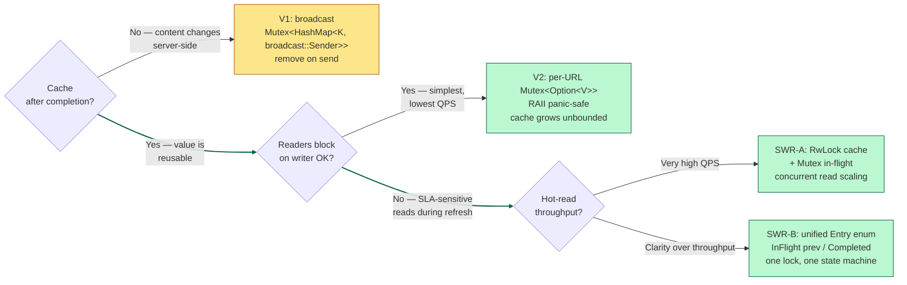

"Just single-flight it" is the usual advice for deduplicating concurrent requests to the same key. The phrase hides a choice, though — two of them. Do you keep the value after the fetch finishes, and can a caller that shows up mid-fetch be made to wait? Those two questions give you a 2×2, and three of its four cells are designs people actually ship. This post walks through the three, the trade-off each one makes, and the questions that tell you which the requirements are asking for.

## The problem, stated precisely

Fifty concurrent callers want the bytes at `URL`. The upstream fetch takes 100ms and costs money. You want three things:

1. **Exactly one** upstream call, not fifty.
2. **All fifty callers** get the bytes.
3. **No caller waits longer than they have to** — ideally not longer than the underlying fetch.

The naive implementation has everybody fetch: fifty upstream calls. A `HashMap<URL, Bytes>` cache behind a mutex doesn't help either — on a miss, the first caller fetches and populates, but the other forty-nine also see a miss and *also* fetch. Fifty upstream calls again, now with more locking.

Single-flight fixes this by electing a **leader**: on a miss, the first caller does the fetch, and concurrent callers become **followers** who wait on the leader's result. One upstream call, fifty replies.

That description is what most people mean by "single-flight." But two decisions are baked into it, and both change the behavior enough that they deserve to be named.

## The two axes

**Axis 1: cache after completion?**
- **Yes** — once the fetch completes, keep the value. Future callers get it from cache without fetching again. You've built a memoizer.
- **No** — once the fetch completes, forget it. The *next* caller after completion triggers a fresh fetch. You've built pure in-flight dedup.

**Axis 2: do readers block on writers?**
- **Yes** — a caller arriving during an in-flight fetch waits for that fetch. Its latency equals your upstream's latency.
- **No** — a caller arriving during an in-flight fetch returns *something* immediately (a stale value, or nothing) without waiting.

Two axes, four combinations:

|  | readers CAN block on writer | readers CANNOT block on writer |
|---|:---:|:---:|
| **cache after completion** | **V2** — per-URL `Mutex<Option<V>>` | **SWR** — split cache + in-flight, or unified state machine |
| **no cache after completion** | **V1** — broadcast, remove on send | *degenerate — nothing to return* |

The fourth cell collapses: if you don't cache, a reader that arrives before any fetch has completed for a key has nothing to return. So there are three real designs. Everything else — moka's config surface, Go's `singleflight.Group`, Temporal's request-id dedup, Cloudflare's origin shield — is one of these three plus scaling work.

## Design 1 (V1): broadcast, no cache

The pure-dedup version, built on `Mutex<HashMap<K, broadcast::Sender<Arc<V>>>>`.

```rust
async fn fetch(&self, k: K, do_fetch: impl FnOnce() -> Fut) -> Arc<V> {
    // Lookup + (insert OR subscribe) UNDER ONE LOCK — race-free.
    let role = {
        let mut map = self.in_flight.lock().unwrap();
        match map.get(&k) {
            Some(tx) => Role::Follower(tx.subscribe()),
            None => {
                let (tx, _) = broadcast::channel(1);
                map.insert(k.clone(), tx.clone());
                Role::Leader(tx)
            }
        }
    };
    match role {
        Role::Leader(tx) => {
            let v = Arc::new(do_fetch().await);
            // Remove BEFORE broadcasting: any caller arriving between
            // remove and send becomes a NEW leader — that's dedup-in-flight,
            // not memoization.
            self.in_flight.lock().unwrap().remove(&k);
            let _ = tx.send(v.clone());
            v
        }
        Role::Follower(mut rx) => rx.recv().await.expect("leader panicked"),
    }
}
```

The leader inserts a `broadcast::Sender` under the lock and does the fetch. Followers find the existing sender and `subscribe()` **under the same lock** — the detail that makes this correct. If lookup and subscribe are two separate lock acquisitions, two leaders can be elected for the same key. Once the fetch completes the leader removes the entry, then broadcasts, and the followers receive.

There's no cache, so the next caller for that key finds an empty map, becomes a fresh leader, and fires a fresh fetch. Readers that arrive during a fetch wait on `rx.recv().await`, so their latency matches the fetch. And if the leader's `do_fetch` panics, its `Sender` drops during unwinding and followers see `RecvError::Closed`; you either `.expect()` to propagate the panic or wrap the leader in a Drop guard that clears the map so the next caller can re-lead.

**When to reach for it:** the value can change server-side and you *cannot* cache, because stale answers are actually wrong. Layer-1 CDN origin shields. Rate-limited APIs where memoizing would violate freshness.

## Design 2 (V2): per-URL mutex holding `Option<V>`

The simpler cached version, built on `HashMap<K, Arc<tokio::sync::Mutex<Option<V>>>>` behind an outer `Mutex` for the map itself.

```rust
async fn fetch(&self, k: K, do_fetch: impl FnOnce() -> Fut) -> Arc<V> {
    // Outer lock: get-or-create the per-key mutex. Fast, no await.
    let slot: Arc<tokio::sync::Mutex<Option<Arc<V>>>> = {
        let mut map = self.slots.lock().unwrap();
        map.entry(k)
            .or_insert_with(|| Arc::new(tokio::sync::Mutex::new(None)))
            .clone()
    };
    // Per-key async lock. Followers queue here.
    let mut guard = slot.lock().await;
    if let Some(v) = &*guard { return v.clone(); }   // cache hit
    // Leader: fetch, fill, drop.
    let v = Arc::new(do_fetch().await);
    *guard = Some(v.clone());
    v
}
```

Each key gets its own `tokio::Mutex<Option<V>>`. The first holder sees `None`, fetches, and fills `Some(v)`; later holders see `Some(v)` and return it, which is the cache. The entry stays in the map, so the next caller sees `Some(v)` immediately — this is a cache, not in-flight dedup, and the distinction is worth keeping straight when you describe it.

Readers during a fetch queue on the per-URL mutex, so their latency matches the fetch, same as V1 by a different mechanism. Panic handling is cleaner than V1: if `do_fetch` panics, the guard drops during unwinding, the slot stays `None`, and the next follower to acquire it becomes a fresh leader. RAII does the work, no Drop guard needed.

**When to reach for it:** you want memoization *and* dedup, and the map growing without bound is either acceptable or handled by an LRU layer (moka's `weigher`). This is what most in-process caches actually build.

## The interview twist: "readers must not be blocked by writers"

This was a real follow-up I got in an interview, and it rules out both V1 and V2 — in both, followers wait on the leader's fetch.

The insight that unlocks it: you can't satisfy "no waiting" without caching. If nothing is cached, a reader arriving mid-fetch has nothing to hand back. So the constraint is really *have something cached, and let readers hit it lock-free even during a refresh*. That's the SWR cell — stale-while-revalidate, HTTP's cache-control directive, and how every serious CDN works.

## Design 3 (SWR): split cache + in-flight, or unified state machine

Two implementations, same behavior. Both put a cache in front of a single-flight so readers hit the cache lock-free while a writer works in the background.

### Version A: two data structures

```rust
struct Downloader {
    // Lock-free-ish cache: many concurrent readers, occasional writer.
    cache: RwLock<HashMap<K, Arc<V>>>,
    // Single-flight for cold-start only.
    in_flight: Mutex<HashMap<K, broadcast::Sender<Arc<V>>>>,
}
```

The fast path is `cache.read().get(&k).cloned()`. If the value is there, return it immediately — even if a refresh is in flight, you get the old value. Only a cold start, where no value has ever been cached, falls through to the single-flight and blocks. Readers touch `in_flight` only on a cold miss; writers populate both.

### Version B: unified state machine

```rust
enum Entry {
    InFlight {
        tx: broadcast::Sender<Arc<V>>,
        prev: Option<Arc<V>>,   // ← what a mid-refresh reader returns
    },
    Completed(Arc<V>),
}

struct Downloader {
    state: Mutex<HashMap<K, Entry>>,
}
```

One `HashMap`, one lock. Readers match on the variant:

| entry state | reader behavior |
|---|:---|
| `Completed(v)` | return `v.clone()` immediately |
| `InFlight { prev: Some(v), .. }` | return `v.clone()` immediately (refresh in progress) |
| `InFlight { prev: None, tx }` | subscribe, wait (cold-start only) |
| `None` (map miss) | become leader, run fetch |

The `prev` field is what unifies the two structures. A refresh transitions `Completed → InFlight { prev: Some(old) }`, so a reader during a refresh still finds something to return. Cold start is the honest exception — `prev: None`, and only then does a reader wait.

Version B is the same behavior as Version A with one lock and less code. The cost is that the single `Mutex` serializes concurrent readers briefly, where Version A's `RwLock` doesn't. Version A wins for hot-read workloads at scale; Version B wins for clarity. If you outgrow the single lock, a `DashMap<K, Entry>` gets the throughput back.

## The state-machine framing

The refactor from A to B generalizes: when two data structures always change together and are always looked up together, they're usually one state machine split across two variables.

Version A treats "in-flight tracking" and "cache" as separate concerns. Version B recognizes they're two states of the same thing — the key's known status — and encodes that as an enum. Doing so removes an ordering hazard: in A you have to insert into the cache *before* removing from `in_flight`, a constraint that's easy to get wrong; in B the transition is one atomic mutation under a single `Mutex::lock()`. This is the same reason Rust code reaches for an `enum` where C reaches for a struct with a tag field and a union.

## The refcount trap (worked example)

Every version of this pattern has a subtle bug that's easy to miss the first time. If your map is `HashMap<K, Arc<Mutex>>` and it has any LRU eviction, evicting an entry while someone holds its mutex silently breaks the design.

```
op A: get(K) → Ctx1, lock Ctx1.mutex
cache: idle → evict Ctx1
op B: get(K) → NEW Ctx2, lock Ctx2.mutex   ← two mutexes for one key
A and B now running concurrently on the same key. Broken.
```

The mutex was supposed to serialize A and B, but B never touched A's mutex — it got a fresh one. The lock is meaningless.

The fix is to refcount the entry, pin it while it's in use, and evict only when the refcount hits zero.

```rust
struct CacheEntry {
    context: Arc<Ctx>,
    refcount: usize,
}

struct Handle {              // RAII: drop = decrement refcount
    context: Arc<Ctx>,
    cache: Arc<Cache>,
    key: K,
}

impl Drop for Handle {
    fn drop(&mut self) {
        let mut entries = self.cache.entries.lock().unwrap();
        if let Some(entry) = entries.get_mut(&self.key) {
            entry.refcount -= 1;
            if entry.refcount == 0 {
                entries.remove(&self.key);
            }
        }
    }
}
```

The test that catches the bug: obtain two handles for the same key and assert `Arc::ptr_eq(&handle_a.context, &handle_b.context)`. If the eviction bug is present, they'll be different Arcs.

This is the same mechanism a DBMS buffer pool calls a **pin count** — pin a page while a transaction is using it, evict only when the pin count is zero. Any cache with a per-key locking primitive needs it: memcached, Redis's internal caches, the PostgreSQL buffer pool, Temporal's workflow context cache. It's worth recognizing here because you'll meet it again in the next per-key-mutex design you build.

## The three questions that pick your design

Ask these upfront in a design review or interview, and the answers land you on a design:

1. **After a fetch completes, should the next caller re-fetch or reuse the value?** → cache (V2 / SWR) or no cache (V1)
2. **If a fetch is in flight, can concurrent callers wait for it, or must they bypass?** → block OK (V1 / V2) or non-blocking (SWR)
3. **If the leader crashes mid-fetch, what should waiters see?** → error propagation (V1) vs. RAII re-lead (V2 / SWR)

Answer 1 = "no" → V1. Answer 1 = "yes" and answer 2 = "block OK" → V2. Answer 1 = "yes" and answer 2 = "non-blocking" → SWR (Version A if hot-read throughput matters, Version B if clarity matters).

## Decision framework



Green nodes are where most services land; yellow marks V1 as the specialized case where you genuinely want no caching. The bold green edges trace the cache-plus-non-blocking path that SLA-sensitive reads usually need.

## Misconceptions worth retiring

**"Single-flight is one pattern."** It's a family of three, sitting in different cells of the cache/block 2×2. Naming which cell you're in tells the reader more than reciting the mechanism does.

**"V2 (per-URL mutex with `Option`) is just a cache with locking."** It's a cache and a single-flight in one structure, and it *conflates* them — readers wait on writers because the same mutex serves both roles. That conflation is a feature (simple, RAII-safe) or a bug (fails a "non-blocking reader" requirement) depending on what you were asked for.

**"You need caching to satisfy 'readers not blocked by writers.'"** Correct. If nothing is cached, a mid-fetch reader has nothing to return. The `prev: Some(v)` field in the unified state machine is where the thing-to-return lives.

**"Removing the in-flight entry before or after the broadcast doesn't matter."** It does. Remove-before-send means a caller arriving between the remove and the send becomes a fresh leader (dedup-in-flight semantics). Remove-after-send means they subscribe to a sender that's already fired and get the old value (stale-share semantics, which a broadcast cap of 1 supports). Both are defensible; state which one you're picking.

**"Refcount is a memory-management detail."** It's a correctness requirement. Without it, LRU eviction of your per-key mutex breaks the single-flight guarantee, because two callers can end up holding two different mutexes for the same logical key.

**"moka handles all of this."** moka's `Cache::get_with(k, init)` is a productionized V2 with LRU on top — V2 semantics, not V1 or SWR. If you need SWR (refresh in the background, readers never wait), you compose `get_with` with `refresh_after_write`, and it's worth knowing that's what you're building on.

**"Sharding solves this."** Sharding scales the pattern across cores by reducing contention with a per-shard mutex. It doesn't change which cell you're in. Temporal shards workflows across history services, and each shard still runs one of these three designs for concurrent operations on a single workflow.

## The one-line distillations

> **The design space.** Concurrent-request dedup is a 2×2 on `{cache?, readers-block?}`. Three real cells; the fourth is degenerate.
>
> **The three designs.** V1 broadcast (no cache), V2 per-key mutex (cache + blocking), SWR (cache + non-blocking). Anything labeled "single-flight" is one of these three.
>
> **The interview twist.** "Reader not blocked by writer" requires caching — a mid-fetch reader needs something already stored to return.
>
> **The state-machine refactor.** When two data structures always change together and are looked up together, encode them as one enum.
>
> **The refcount trap.** A per-key mutex in an LRU cache without a refcount is silently broken. It's the same pin count a DBMS buffer pool uses.
>
> **The three questions.** Cache after completion? Block during fetch? What do waiters see on a leader crash? The answers pick the design.

The short version: **name the cell before you write the code. Cache-or-not and block-or-not decide the design; LRU, sharding, and tiering are downstream and don't change the choice.**

## Further reading

- [`golang.org/x/sync/singleflight`](https://pkg.go.dev/golang.org/x/sync/singleflight) — the canonical implementation of V1 (broadcast, remove on send); short and readable
- [`moka` crate](https://docs.rs/moka) — the productionized V2 for Rust with LRU + TTL + refresh-after-write; also read the [Caffeine design notes](https://github.com/ben-manes/caffeine/wiki/Design) it's based on
- [HTTP `Cache-Control: stale-while-revalidate`](https://datatracker.ietf.org/doc/html/rfc5861) — the SWR spec, and where the vocabulary comes from
- [Segcache paper (NSDI 2021)](https://www.usenix.org/conference/nsdi21/presentation/yang-juncheng) — Yao Yue's TTL-oriented cache design at Twitter
- [Cloudflare tiered cache](https://blog.cloudflare.com/tiered-cache/) — SWR plus single-flight at edge scale
- [Temporal's `WorkflowIdReusePolicy`](https://docs.temporal.io/workflows#workflow-id-reuse-policy) — a related pattern (per-key mutex plus persisted request-id) that shares the refcount trap and the buffer-pool lineage
- CMU 15-445, [Buffer Pool lecture](https://15445.courses.cs.cmu.edu/fall2023/schedule.html) — where the pin-count / refcount pattern originates
