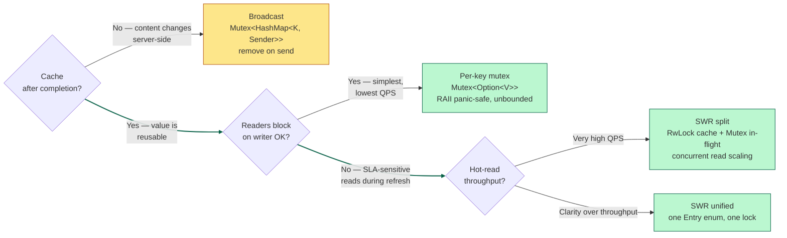

"Just single-flight it" is standard advice for collapsing concurrent requests to the same key. It sounds like one technique. It isn't: hiding under the name are two independent decisions — whether you keep the value once the fetch finishes, and whether a caller that arrives mid-fetch has to wait. Cross the two and you get a 2×2 grid. Three of the four cells are designs people actually ship; the fourth doesn't make sense. This post goes through the three, what each one trades away, and how to tell which one a requirement is asking for.

## The problem

Fifty callers want the bytes at the same URL, at the same time. The upstream fetch takes 100ms and costs money. You want exactly one upstream call, all fifty callers to end up with the bytes, and no caller waiting longer than the fetch itself.

The naive version fires fifty fetches. Putting a `HashMap<URL, Bytes>` behind a mutex doesn't help: the first caller sees a miss and starts fetching, but for the next 100ms the cache is still empty, so the other forty-nine also see a miss and fetch too. Fifty upstream calls either way, now with extra locking.

Single-flight fixes this by electing a leader. The first caller to miss does the fetch; anyone arriving while it's in flight becomes a follower and waits for the leader's result. One upstream call, fifty replies.

That's the part everyone agrees on. What the name leaves unspecified are two decisions, and each one changes the behavior.

## The two axes

First decision — what happens after the fetch completes?

- Keep the value. Future callers read it from the cache without fetching. This is memoization.
- Throw it away. The next caller triggers a fresh fetch. This is pure in-flight dedup.

Second decision — what happens to a caller that arrives while a fetch is in flight?

- It waits. Its latency becomes your upstream's latency.
- It gets something back immediately (a stale value, or nothing) without waiting.

Two axes, four combinations:

|  | readers block on writer | readers don't block |
|---|:---|:---|
| **cache after completion** | **per-key mutex** — `Mutex<Option<V>>` per key | **stale-while-revalidate** — cache in front of a single-flight |
| **no cache** | **broadcast** — dedup only, remove on send | *degenerate — nothing to return* |

The empty cell is the no-cache, non-blocking combination, and it collapses on contact: if nothing is ever cached and the caller refuses to wait, there is nothing to hand back. So three real designs. Everything else in the wild — moka's configuration surface, Go's `singleflight.Group`, Temporal's request-id dedup, Cloudflare's origin shield — is one of these three plus scaling work.

## Broadcast: dedup with no cache

This is the no-cache design. The entire structure is `Mutex<HashMap<K, broadcast::Sender<Arc<V>>>>` — a map of in-flight fetches and nothing else.

```rust
async fn fetch(&self, k: K, do_fetch: impl FnOnce() -> Fut) -> Arc<V> {
    // Lookup + (insert OR subscribe) UNDER ONE LOCK — race-free.
    let role = {
        let mut map = self.in_flight.lock().unwrap();
        match map.get(&k) {
            Some(tx) => Role::Follower(tx.subscribe()),
            None => {
                let (tx, _) = broadcast::channel(1);
                map.insert(k.clone(), tx.clone());
                Role::Leader(tx)
            }
        }
    };
    match role {
        Role::Leader(tx) => {
            let v = Arc::new(do_fetch().await);
            // Remove BEFORE broadcasting — the order matters. Reversed,
            // a caller could find the sender AFTER it fired, subscribe
            // too late, and never receive the value. See below.
            self.in_flight.lock().unwrap().remove(&k);
            let _ = tx.send(v.clone());
            v
        }
        Role::Follower(mut rx) => rx.recv().await.expect("leader panicked"),
    }
}
```

The correctness hinge is that lookup and subscribe happen under a single lock acquisition. A follower finds the existing sender and subscribes before the lock is released. Split that into two acquisitions — check the map, release, then subscribe — and two callers can both see an empty map and both become leaders for the same key, which is exactly what you were trying to prevent.

There's no cache, so once the leader removes the entry and broadcasts, the next caller finds an empty map and starts a fresh fetch. Followers that arrive mid-fetch wait on `rx.recv().await`, so their latency matches the fetch.

### Why remove before send?

Because a `broadcast::Receiver` only sees values sent *after* it subscribed — nothing replays. If the leader sends first, there's a moment where the sender is still in the map but has already fired. A caller arriving in that moment subscribes too late, misses the value, and gets `Err(Closed)` when the sender drops — stuck forever, even though the fetch succeeded.

Removing first makes the map honest: if you can find the sender, the send hasn't happened yet, so you're guaranteed to receive it. Callers arriving after the remove just start a fresh fetch as a new leader — which is what a no-cache design wants anyway.

Panics need a decision. If `do_fetch` panics, the leader's `Sender` is dropped as the stack unwinds, and every follower's `recv()` fails with `RecvError::Closed`. Either `.expect()` it so the panic propagates to the followers too, or wrap the leader in a Drop guard that clears the map entry so the next caller can take over as leader and retry.

**When to reach for it:** the value changes server-side and stale answers are wrong, so you can't cache. Layer-1 CDN origin shields. Rate-limited APIs where memoizing would violate freshness.

## Per-key mutex: cache that blocks readers

The simplest cached design: each key gets its own mutex over an `Option`, and an outer lock hands them out — `HashMap<K, Arc<tokio::sync::Mutex<Option<V>>>>`.

```rust
async fn fetch(&self, k: K, do_fetch: impl FnOnce() -> Fut) -> Arc<V> {
    // Outer lock: get-or-create the per-key mutex. Fast, no await.
    let slot: Arc<tokio::sync::Mutex<Option<Arc<V>>>> = {
        let mut map = self.slots.lock().unwrap();
        map.entry(k)
            .or_insert_with(|| Arc::new(tokio::sync::Mutex::new(None)))
            .clone()
    };
    // Per-key async lock. Followers queue here.
    let mut guard = slot.lock().await;
    if let Some(v) = &*guard { return v.clone(); }   // cache hit
    // Leader: fetch, fill, drop.
    let v = Arc::new(do_fetch().await);
    *guard = Some(v.clone());
    v
}
```

The first caller to acquire the per-key lock sees `None`, fetches, and fills in `Some(v)`. Everyone queued behind it then acquires the lock, sees `Some(v)`, and returns it. The entry stays in the map afterward, so later callers get a plain cache hit with no fetch at all. This is a cache, not just in-flight dedup.

Callers arriving during a fetch queue on the per-key mutex, so their latency matches the fetch — the same outcome as broadcast, by a different mechanism. Panic handling comes for free here: if `do_fetch` panics, the guard drops during unwinding, the slot is still `None`, and whoever acquires the lock next becomes the new leader. RAII does the work; no Drop guard needed.

**When to reach for it:** you want memoization and dedup together, and either the map growing without bound is acceptable or an LRU layer handles it (moka's `weigher`). Most in-process caches are this design.

## Adding the non-blocking requirement

Now add a third requirement: a reader must never block on a writer. Both designs so far fail it, because in both, followers sit and wait for the leader's fetch.

Here's the catch: you can't satisfy "never wait" without caching. A reader arriving mid-fetch either waits or returns something, and if nothing is cached there is nothing to return. So the requirement really means: keep a value around, and let readers grab it even while a refresh is running. That's stale-while-revalidate (SWR) — the HTTP cache-control directive of the same name, and the way CDNs keep serving reads while the origin refreshes underneath.

## Stale-while-revalidate: cache that doesn't block readers

Two implementations with the same behavior. Both put a cache in front of a single-flight, so readers hit the cache while a writer refreshes in the background.

### Version A: split (two data structures)

```rust
struct Downloader {
    // Lock-free-ish cache: many concurrent readers, occasional writer.
    cache: RwLock<HashMap<K, Arc<V>>>,
    // Single-flight for cold-start only.
    in_flight: Mutex<HashMap<K, broadcast::Sender<Arc<V>>>>,
}
```

The fast path is `cache.read().get(&k).cloned()`. If the value is there, return it immediately — even mid-refresh, you just get the old value. Only a cold start, where the key has never been cached, falls through to the single-flight and blocks. Readers touch `in_flight` only on that cold miss; writers populate both structures.

### Version B: unified (one state machine)

```rust
enum Entry {
    InFlight {
        tx: broadcast::Sender<Arc<V>>,
        prev: Option<Arc<V>>,   // ← what a mid-refresh reader returns
    },
    Completed(Arc<V>),
}

struct Downloader {
    state: Mutex<HashMap<K, Entry>>,
}
```

One map, one lock. A reader matches on the entry:

| entry state | reader behavior |
|---|:---|
| `Completed(v)` | return `v.clone()` immediately |
| `InFlight { prev: Some(v), .. }` | return `v.clone()` immediately (refresh in progress) |
| `InFlight { prev: None, tx }` | subscribe, wait (cold-start only) |
| `None` (map miss) | become leader, run fetch |

The `prev` field is what merges Version A's two structures into one. When a refresh starts, the entry goes from `Completed(v)` to `InFlight { prev: Some(v) }`, so a reader during the refresh still finds a value to return. The only time a reader waits is a cold start, where `prev` is `None` because no value has ever existed.

The trade between them: Version B is less code with no ordering hazards, but its single `Mutex` briefly serializes readers that Version A's `RwLock` would let through in parallel. At very high read volume, A wins; everywhere else, B's clarity wins. If B's single lock ever does become the bottleneck, swapping in a `DashMap<K, Entry>` gets the throughput back without changing the design.

## The state-machine framing

The A-to-B refactor generalizes. When two data structures always change together and are always looked up together, they're usually one state machine accidentally split across two variables.

Version A treats "in-flight tracking" and "cache" as separate concerns. Version B notices they're two states of the same question — what do we currently know about this key? — and writes that down as an enum. Doing so removes an ordering hazard: in A, a finishing refresh must insert into the cache *before* removing from `in_flight`, because doing it in the other order opens a window where a reader finds the key in neither structure and starts a redundant fetch. In B, the transition is one mutation under one lock, so the window doesn't exist. It's the same instinct that makes Rust code reach for an `enum` where C reaches for a struct with a tag field and a union.

## The refcount trap (worked example)

Every version of this pattern grows the same bug once eviction shows up. If the map is `HashMap<K, Arc<Mutex>>` and anything — an LRU, a TTL sweep — can evict entries, then evicting an entry while someone holds its mutex silently breaks the design:

```
op A: get(K) → Ctx1, lock Ctx1.mutex
cache: idle → evict Ctx1
op B: get(K) → NEW Ctx2, lock Ctx2.mutex   ← two mutexes for one key
A and B now running concurrently on the same key. Broken.
```

The mutex was supposed to serialize A and B. But B never touched A's mutex — the eviction threw it out, and B got a fresh one. Both callers proceed at once, each convinced it holds the lock.

The fix is to refcount the entry: pin it while anyone is using it, and only evict at zero.

```rust
struct CacheEntry {
    context: Arc<Ctx>,
    refcount: usize,
}

struct Handle {              // RAII: drop = decrement refcount
    context: Arc<Ctx>,
    cache: Arc<Cache>,
    key: K,
}

impl Drop for Handle {
    fn drop(&mut self) {
        let mut entries = self.cache.entries.lock().unwrap();
        if let Some(entry) = entries.get_mut(&self.key) {
            entry.refcount -= 1;
            if entry.refcount == 0 {
                entries.remove(&self.key);
            }
        }
    }
}
```

The test that catches this: grab two handles for the same key and assert `Arc::ptr_eq(&handle_a.context, &handle_b.context)`. With the bug present, they're different Arcs.

Database people will recognize this as a buffer pool's pin count: pin the page while a transaction uses it, evict only when the pin count is zero. Any cache that keeps a lock or context per key needs the same thing — memcached, Redis's internal caches, the PostgreSQL buffer pool, Temporal's workflow context cache.

## Picking a design

Three questions settle it:

1. **After a fetch completes, should the next caller re-fetch or reuse the value?** Reuse means you're caching (per-key mutex or SWR); re-fetch means broadcast.
2. **While a fetch is in flight, can concurrent callers wait for it?** If waiting is fine, broadcast or per-key mutex; if readers must not block, SWR.
3. **If the leader dies mid-fetch, what should waiters see?** Broadcast propagates the error to followers; per-key mutex and SWR quietly elect a new leader via RAII.



Green nodes are where most services land; yellow is broadcast, the specialized no-cache case. The bold edges trace the cache-plus-non-blocking path that latency-sensitive reads usually need.

## Misconceptions

**"Single-flight is one pattern."** It's a family of three, sitting in different cells of the cache/block 2×2. Naming which one you mean is more useful than reciting the mechanism.

**"The per-key-mutex design is just a cache with locking."** It's a cache and a single-flight in one structure, and it deliberately conflates them: readers wait on writers because one mutex serves both roles. Whether that conflation is a feature (simple, panic-safe by construction) or a bug (fails a non-blocking-reader requirement) depends on what you were asked for.

**"A clever enough lock gives you non-blocking readers without a cache."** No lock does. A mid-fetch reader either waits or returns a previously stored value, and if nothing is stored, waiting is the only option. The `prev: Some(v)` field in the unified state machine is exactly where that stored value lives.

**"Removing the in-flight entry before or after the broadcast doesn't matter."** With `broadcast`, remove-after-send is a bug, not an alternative. A caller landing in the send-to-remove gap finds the sender, subscribes after the value has gone by, and gets `Closed` instead of the value — a receiver never sees sends from before it subscribed. Getting stale-share semantics (the gap caller receives the old value) requires a primitive that replays the latest value, like `watch` — and storing a value past completion is caching, a different cell of the grid.

**"Refcounting is a memory-management detail."** It's a correctness requirement. Without it, LRU eviction of a per-key mutex breaks the single-flight guarantee: two callers end up holding two different mutexes for the same key.

**"moka handles all of this."** moka's `Cache::get_with(k, init)` is a productionized per-key-mutex design with LRU on top — that cell, not broadcast or SWR. For SWR behavior (refresh in the background, readers never wait), you compose `get_with` with `refresh_after_write`, and it helps to know that's what you're building.

**"Sharding solves this."** Sharding reduces contention by giving each shard its own lock. It scales whichever design you picked; it doesn't change which cell you're in. Temporal shards workflows across history services, and each shard still runs one of these three designs for concurrent operations on a single workflow.

## The one-line distillations

> **The design space.** Concurrent-request dedup is a 2×2 on `{cache?, readers-block?}`. Three real cells; the fourth has nothing to return.
>
> **The three designs.** Broadcast (no cache), per-key mutex (cache + blocking), SWR (cache + non-blocking). Anything called single-flight is one of these three.
>
> **The non-blocking case.** "Readers never block on writers" requires caching, because a mid-fetch reader needs something already stored to return.
>
> **The state-machine refactor.** When two data structures always change together and are looked up together, encode them as one enum.
>
> **The refcount trap.** A per-key mutex in an LRU cache without a refcount is silently broken. It's the pin count from a DBMS buffer pool.
>
> **The three questions.** Cache after completion? Block during fetch? What do waiters see when the leader crashes?

The short version: name the combination before you write the code. Cache-or-not and block-or-not decide the design; LRU, sharding, and tiering come afterward and don't change the choice.

## Further reading

- [`golang.org/x/sync/singleflight`](https://pkg.go.dev/golang.org/x/sync/singleflight) — the canonical broadcast implementation (remove on send); short and readable
- [`moka` crate](https://docs.rs/moka) — the productionized per-key-mutex design for Rust with LRU + TTL + refresh-after-write; also read the [Caffeine design notes](https://github.com/ben-manes/caffeine/wiki/Design) it's based on
- [HTTP `Cache-Control: stale-while-revalidate`](https://datatracker.ietf.org/doc/html/rfc5861) — the SWR spec, and where the vocabulary comes from
- [Segcache paper (NSDI 2021)](https://www.usenix.org/conference/nsdi21/presentation/yang-juncheng) — Yao Yue's TTL-oriented cache design at Twitter
- [Cloudflare tiered cache](https://blog.cloudflare.com/tiered-cache/) — SWR plus single-flight at edge scale
- [Temporal's `WorkflowIdReusePolicy`](https://docs.temporal.io/workflows#workflow-id-reuse-policy) — a related pattern (per-key mutex plus persisted request-id) that shares the refcount trap and the buffer-pool lineage
- CMU 15-445, [Buffer Pool lecture](https://15445.courses.cs.cmu.edu/fall2023/schedule.html) — where the pin-count / refcount pattern originates
